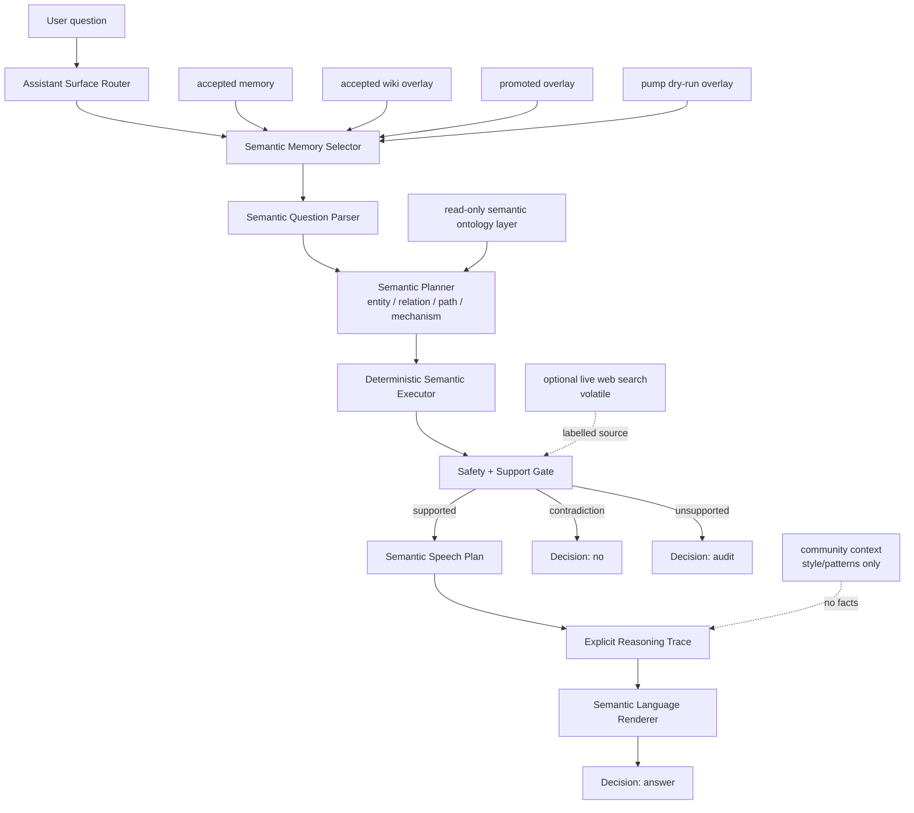
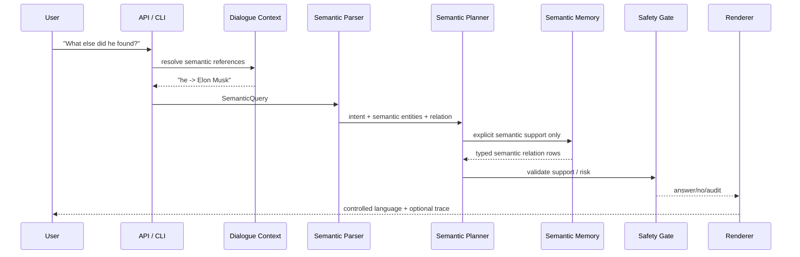

# Microworld

Experimental semantic AI runtime exploring explicit memory, deterministic
reasoning, dialogue systems, and controlled language generation.

Microworld tests a new approach to AI: build the runtime around explicit,
inspectable semantic state instead of asking one opaque next-token model to do
facts, reasoning, dialogue, style, and safety at the same time. The project is
a research implementation of semantic memory, semantic reasoning, semantic
dialogue context, and a separately controlled speech layer.

The current system is not AGI and not an open-domain replacement for modern
LLMs. It is a bounded explicit-memory AI runtime that answers only when it can
point to controlled semantic memory, says `audit` when support is missing, and
keeps factual support separate from reasoning, dialogue, language style,
community patterns, live search, and session context.

The central abstraction in Microworld is semantics. Graphs may be used as one
storage representation for semantic structures, but the project is not
fundamentally a graph database or graph QA engine. A graph edge is useful
because it encodes a semantic relation; the relation is the important object,
not the storage shape.

## Research Question

```text
Can useful inference, memory growth, dialogue, controlled language generation,
and trust learning be built from explicit semantic entities, typed relations,
mechanism roles, safety policy, and deterministic planners instead of hidden
model weights?
```

The current answer is stronger than a toy answer bot: inside bounded
explicit-memory domains, the runtime can transform language into semantic
structures, answer, audit, reason over gaps, carry dialogue context, render
controlled English, and hold quality under a 1,000-question deterministic
speech benchmark. The important new result is that the answer surface is now
measured separately from factual coverage: speech can be tested, improved, and
stress-tested without pretending that a phrase model is factual memory.

## Key Ideas

- Semantic-first runtime: text is an interface, not the internal reasoning
  substrate.
- Explicit memory: accepted memory, overlays, proposals, snapshots, weak
  context, and dialogue state remain separate artifacts.
- Deterministic reasoning: support checks, relation/path/mechanism decisions,
  contradiction handling, and audit decisions are inspectable.
- Dialogue context: follow-up questions resolve over explicit semantic state,
  not hidden chat history.
- Controlled language generation: facts are selected by semantic support;
  speech is rendered separately.
- Safety by boundary: unsupported, current-sensitive, private, ambiguous, or
  weakly supported claims audit instead of being guessed.

The core behavior is deliberately boring in the best possible way:

```text
supported semantic claim present -> answer
explicit contradiction          -> no
weak/volatile/current gap       -> audit
unknown or unsupported form     -> audit
```

No answer should appear because a model "felt" that it was plausible.

## Latest Benchmark Snapshot

Latest speech/reasoning snapshot, from
`worldpgt/experiments/benchmarks/speech_quality_large_20260709T111746Z.json`
and
`worldpgt/experiments/benchmarks/speech_quality_stress_20260709T111906Z.json`:

| Metric | Large suite | Stress suite |
|---|---:|---:|
| Questions | 50 | 1,000 |
| Passed | 50 / 50 | 1,000 / 1,000 |
| Quality rate | 100.0% | 100.0% |
| Honest gap rate | 9 / 9 | 171 / 171 |
| Debug-like output | 0 | 0 |
| Repetitive output | 0 | 0 |
| Decision drift | 0 | 0 |
| Missing required text | 0 | 0 |
| Latency p50 | 3.39 ms | 8.05 ms |
| Latency p95 | 26.98 ms | 29.47 ms |
| Latency p99 | 27.73 ms | 38.90 ms |

The stress suite is a deterministic 1,000-question speech benchmark over known
categories, not 1,000 independent open-domain facts. Its purpose is to measure
the user-facing speech/reasoning surface under load: profiles, thin profiles,
mechanism gaps, direct relations, connection paths, adversarial inversions,
current/live requests, private-info requests, unsupported universal claims, and
style control.

For complete benchmark history, performance details, live-search numbers, and
validation commands, see [docs/benchmarks.md](docs/benchmarks.md).

## High-Level Architecture

At the top level, the runtime is no longer just an answer surface:

```text
Text -> Semantic Structures -> Semantic Reasoning -> Semantic Dialogue Context
     -> Semantic Language Renderer -> Answer
```

Semantic memory, reasoning, dialogue, and speech stay separate so each layer
can be measured, audited, and improved without silently changing the others.
Storage may be tabular JSON, overlay rows, indexes, or graph-shaped structures;
the runtime contract is semantic, not storage-specific.



| Layer | Code |
|---|---|
| Assistant surface | `worldpgt/assistant_surface/` |
| Web/API UI | `worldpgt/api/` |
| Semantic dialogue context | `worldpgt/dialogue/` |
| Semantic reasoning and speech planning | `worldpgt/cognition/`, `worldpgt/entity_qa/semantic_speech_planner.py` |
| Community speech/cognitive patterns | `worldpgt/community_context/` |
| Optional live search | `worldpgt/web_search/` |
| Semantic entity inference | `worldpgt/entity_qa/` |
| Semantic query primitives | `worldpgt/query_engine/` |
| Multi-hop semantic reasoning | `worldpgt/multihop_qa/` |
| Relation extraction | `worldpgt/relation_extraction_v2/` |
| Knowledge pump | `worldpgt/knowledge_pump/` |
| Safety and temporal policy | `worldpgt/knowledge/`, `worldpgt/relation_extraction_v2/relation_policy.py` |

See [docs/architecture.md](docs/architecture.md) and
[docs/semantic_runtime.md](docs/semantic_runtime.md) for the detailed
engineering model.

## Runtime Flow



The parser currently recognizes relation lookup, inverse lookup, comparative
questions, `is_a` traversal, count, filtered lookup, path/connection questions,
and open synthesis.

## Dialogue Example

Dialogue context is explicit semantic state, not model memory and not a hidden
chat log. It may select which existing entity a later question refers to, but
it may not create a fact about that entity.

```text
Q1: Tell me about SpaceX.
A1: SpaceX is an aerospace manufacturer and space transportation company.

Q2: Who founded it?
Resolution:
  slot "it" -> SpaceX
  strategy: salience
A2: SpaceX was founded by Elon Musk.

Q3: Tell me about Elon Musk.
A3: Elon Musk is a businessman and entrepreneur.

Q4: What else did he found?
Resolution:
  slot "he" -> Elon Musk
  exclusion: already surfaced SpaceX for founded_by
A4: Elon Musk founded Tesla, Neuralink, The Boring Company, xAI, Zip2, and Big Green.
```

Ambiguity produces an audit rather than a best guess. The detailed state model,
resolver rules, benchmark behavior, and migration path are documented in
[docs/dialogue_context.md](docs/dialogue_context.md).

## Benchmark Example

`benchmark_speech_quality_v1.py` measures the answer surface, not factual
coverage. It treats the semantic planner as an explicit-memory lookup and
checks whether speech stays natural, honest about gaps, non-repetitive, and
free of debug/internal wording.

```bash
python3 -m worldpgt.experiments.benchmark_speech_quality_v1 --suite stress
```

Deterministic speech-renderer benchmark snapshot:

| Metric | Value |
|---|---:|
| questions | 1,000 |
| passed | 1,000 / 1,000 |
| quality_rate | 100.0% |
| honest_gap_rate | 171 / 171 |
| mean latency | 14.71 ms |
| p50 latency | 8.05 ms |
| p95 latency | 29.47 ms |
| p99 latency | 38.90 ms |
| max latency | 123.53 ms |
| debug-like output | 0 |
| repetitive output | 0 |
| decision drift | 0 |

Treat this as a workload-specific runtime result, not a universal benchmark.

## Repository Layout

```text
worldpgt/
  api/                    FastAPI server and static UI
  assistant_surface/      orchestrator, router, context selector, styles
  cognition/              reasoning traces, thought loop, semantic moves, phrase storage
  community_context/      Reddit/HN-style context and semantic pattern memory
  dialogue/               semantic dialogue state and reference resolution
  entity_qa/              semantic parser, analyzer, planner, renderer, synthesis
  web_search/             optional volatile live-search providers and cache
  query_engine/           semantic Find, Filter, Count, Compare, Traverse, Classify
  multihop_qa/            explicit semantic relation-chain reasoning
  cross_page_qa/          controlled cross-page connection QA
  relation_extraction_v2/ relation policy, patterns, validators
  knowledge_pump/         extraction yield, precision gates, frontier logic
  knowledge/              entity types, staleness, ontology helpers
  pump_fact_qa/           generated fact-QA checks for pump outputs
  experiments/            runners, artifacts, overlays, reports
  docs/                   implementation audit, safety model, overlay notes
docs/                     project-level engineering documentation
```

## Quick Start

CLI:

```bash
python3 worldpgt/experiments/ask_microworld_v1.py \
  --overlay pump-dry-run \
  --enable-multihop \
  "Who founded SpaceX?"
```

Interactive session with dialogue context:

```bash
python3 worldpgt/experiments/ask_microworld_v1.py \
  --overlay pump-dry-run \
  --enable-multihop \
  --interactive
```

Web UI / API:

```bash
python3 -m worldpgt.api.server --overlay pump-dry-run --port 8000
# open http://localhost:8000
```

Focused speech/reasoning benchmark:

```bash
python3 -m worldpgt.experiments.benchmark_speech_quality_v1 --suite stress
```

The expanded runner list and validation notes are in
[docs/benchmarks.md](docs/benchmarks.md) and
[docs/knowledge_pump.md](docs/knowledge_pump.md).

## Documentation

| Document | Description |
|---|---|
| [architecture.md](docs/architecture.md) | Module boundaries, memory buckets, community context, optional live search, and runtime artifacts. |
| [semantic_runtime.md](docs/semantic_runtime.md) | Semantic-first design, planning, question types, examples, and support contracts. |
| [dialogue_context.md](docs/dialogue_context.md) | Explicit session state, resolver behavior, ambiguity handling, and dialogue-v2 migration. |
| [language_renderer.md](docs/language_renderer.md) | Controlled text generation, phrase graph behavior, styles, and surface validation. |
| [knowledge_pump.md](docs/knowledge_pump.md) | Proposal-only acquisition, precision gates, frontier loops, and pump status. |
| [safety_model.md](docs/safety_model.md) | Support policy, temporal policy, memory boundaries, live-search disclosure, and known safety limits. |
| [benchmarks.md](docs/benchmarks.md) | Current benchmark snapshots, performance, WebQuestions-style results, validation commands, and artifact paths. |
| [research_results.md](docs/research_results.md) | Preserved historical tracks, demonstrated results, limitations, next work, and project status. |

## Status

Experimental and local. The active path is a bounded semantic-memory runtime
with deterministic planning, explicit support checks, dialogue state, and
controlled rendering. It is useful where the current artifacts contain support;
outside that boundary it should audit or label volatile sources. The research
target is inspectability of memory, trust, policy, dialogue, and rendering, not
open-ended language-model generality.
