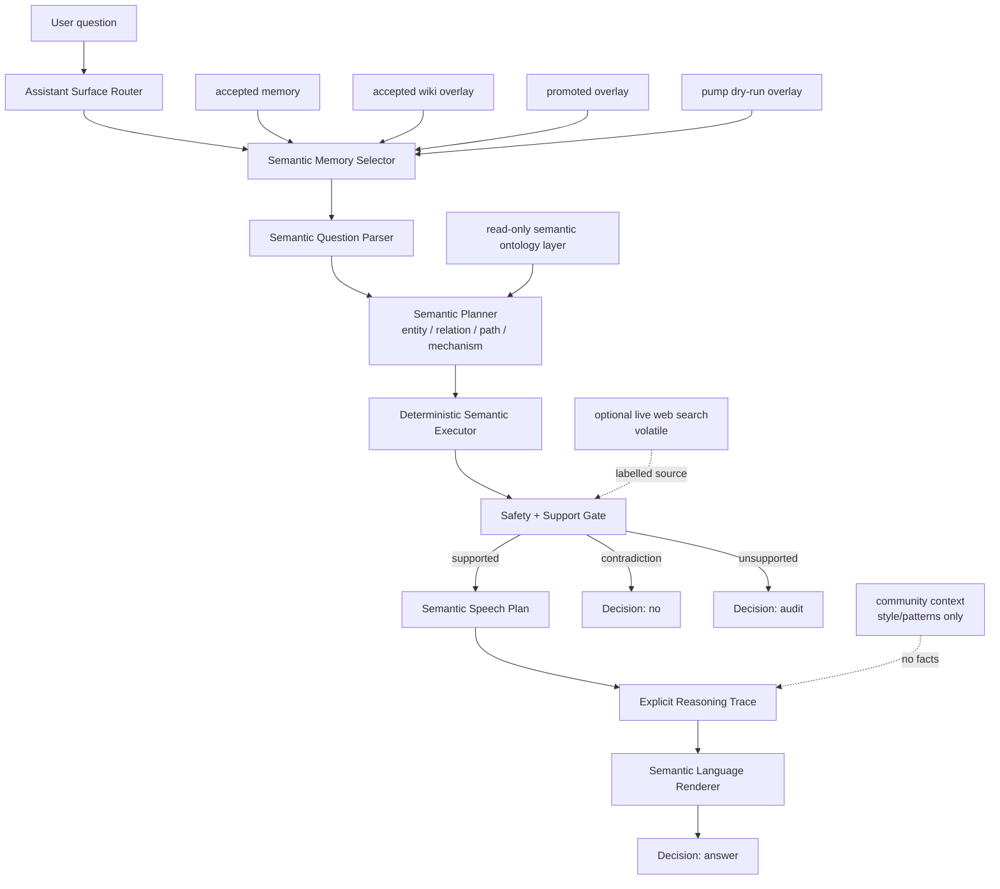
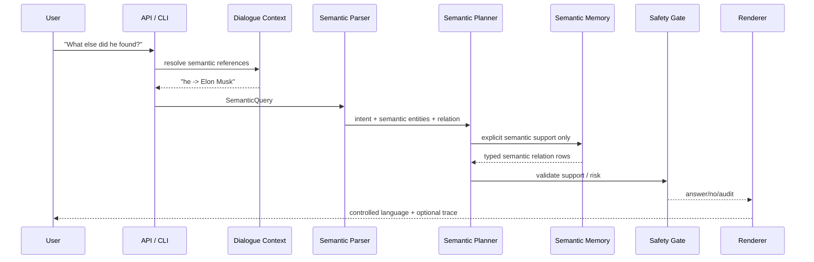

[](https://doi.org/10.5281/zenodo.21323152)
[](LICENSE)

# Microworld

Experimental semantic AI runtime exploring explicit memory, deterministic
reasoning, dialogue systems, and controlled language generation.

## What It Is

Microworld tests a new approach to AI: build the runtime around explicit,
inspectable semantic state instead of asking one opaque next-token model to do
facts, reasoning, dialogue, style, and safety at the same time. The project is
a research implementation of semantic memory, semantic reasoning, semantic
dialogue context, and a separately controlled speech layer.

Microworld is a bounded explicit-memory runtime that answers only when it can
point to controlled semantic memory, says `audit` when support is missing, and
keeps factual support separate from reasoning, dialogue, language style,
community patterns, live search, and session context.

## Try It Locally

The fastest reproducible path is the self-contained
[standalone runtime](microworld-standalone/README.md). It includes the local
runtime artifacts required by the default demo, so there is no model download,
API key, database, or external service to configure.

```bash
git clone https://github.com/zowelqqee/microworld.git
cd microworld/microworld-standalone
python3 -m venv .venv
source .venv/bin/activate
python3 -m pip install --upgrade pip
python3 -m pip install .
microworld "Who founded SpaceX?" --overlay pump-dry-run
```

To start the local web UI after installation:

```bash
microworld-api --overlay pump-dry-run --port 8000
```

Open <http://127.0.0.1:8000>. For an interactive terminal session, run
`microworld --overlay pump-dry-run --interactive`.

The central abstraction in Microworld is semantics. Graphs may be used as one
storage representation for semantic structures, but the project is not
fundamentally a graph database or graph QA engine. A graph edge is useful
because it encodes a semantic relation; the relation is the important object,
not the storage shape.

## Research Question

```text
Can useful inference, memory growth, dialogue, controlled language generation,
and trust learning be built from explicit semantic entities, typed relations,
mechanism roles, safety policy, and deterministic planners instead of hidden
model weights?
```

The current answer is stronger than a toy answer bot: inside bounded
explicit-memory domains, the runtime can transform language into semantic
structures, answer, audit, reason over gaps, carry dialogue context, render
controlled English, and hold quality under a 1,000-question deterministic
speech benchmark. The important new result is that the answer surface is now
measured separately from factual coverage: speech can be tested, improved, and
stress-tested without pretending that a phrase model is factual memory.

## Key Ideas

- Local-first performance: indexed semantic-memory lookup and small
  deterministic planners keep the supported answer path in milliseconds on the
  measured workload, without GPU inference or per-answer model-API calls.
- On-device by design: the unmodified stdlib-only Python answer path is embedded
  in the native iPhone demo, so the runtime can work offline rather than merely
  forwarding prompts to a server.
- Semantic-first runtime: text is an interface, not the internal reasoning
  substrate.
- Explicit memory: accepted memory, overlays, proposals, snapshots, weak
  context, and dialogue state remain separate artifacts.
- Deterministic reasoning: support checks, relation/path/mechanism decisions,
  contradiction handling, and audit decisions are inspectable.
- Dialogue context: follow-up questions resolve over explicit semantic state,
  not hidden chat history.
- Controlled language generation: facts are selected by semantic support;
  speech is rendered separately.
- Safety by boundary: unsupported, current-sensitive, private, ambiguous, or
  weakly supported claims audit instead of being guessed.

The core behavior is deliberately boring in the best possible way:

```text
supported semantic claim present -> answer
explicit contradiction          -> no
weak/volatile/current gap       -> audit
unknown or unsupported form     -> audit
```

No answer should appear because a model "felt" that it was plausible.

## Latest Performance and Reliability Snapshot

**Fast, low-cost semantic AI that runs locally — including offline on an
iPhone.** Microworld answers supported questions from explicit memory and
deterministic reasoning. It is built for millisecond-scale local answers,
inspectable decisions, predictable resource use, and supported memory-backed
questions.

| What an engineer gets | Current evidence |
|---|---|
| Fast local answer path | 8.05 ms p50 and 29.47 ms p95 in the 1,000-question deterministic stress suite |
| Local execution | Local CPU on the tested path; no external service required for the bundled demo |
| Real on-device runtime | The same engine runs fully offline in a native SwiftUI app on a physical iPhone 11 |
| Controlled answers | Explicit support returns an answer; unsupported or risky requests audit instead of being guessed |

The iPhone demo embeds CPython and runs the real QA and creative engines with
no server or network. See [the on-device demo](ios_demo/README_IOS.md) and
[device benchmark notes](ios_demo/DEVICE_BENCHMARK.md) for the measured memory
status and the distinction between Mac reference figures and device figures.

Latest speech/reasoning snapshot, from
`worldpgt/experiments/benchmarks/speech_quality_large_20260709T111746Z.json`
and
`worldpgt/experiments/benchmarks/speech_quality_stress_20260709T111906Z.json`:

| Metric | Large suite | Stress suite |
|---|---:|---:|
| Questions | 50 | 1,000 |
| Passed | 50 / 50 | 1,000 / 1,000 |
| Quality rate | 100.0% | 100.0% |
| Honest gap rate | 9 / 9 | 171 / 171 |
| Debug-like output | 0 | 0 |
| Repetitive output | 0 | 0 |
| Decision drift | 0 | 0 |
| Missing required text | 0 | 0 |
| Latency p50 | 3.39 ms | 8.05 ms |
| Latency p95 | 26.98 ms | 29.47 ms |
| Latency p99 | 27.73 ms | 38.90 ms |

The stress suite is a deterministic 1,000-question speech benchmark over known
categories, not 1,000 independent open-domain facts. It shows that the local
CPU answer path stays in the millisecond range under this workload without a
GPU or model API. Its purpose is to measure the user-facing
speech/reasoning surface under load: profiles, thin profiles, mechanism gaps,
direct relations, connection paths, adversarial inversions, current/live
requests, private-info requests, unsupported universal claims, and style
control.

For complete benchmark history, performance details, live-search numbers, and
validation commands, see [docs/benchmarks.md](docs/benchmarks.md).

## High-Level Architecture

At the top level, the runtime is no longer just an answer surface:

```text
Text -> Semantic Structures -> Semantic Reasoning -> Semantic Dialogue Context
     -> Semantic Language Renderer -> Answer
```

Semantic memory, reasoning, dialogue, and speech stay separate so each layer
can be measured, audited, and improved without silently changing the others.
Storage may be tabular JSON, overlay rows, indexes, or graph-shaped structures;
the runtime contract is semantic, not storage-specific.



| Layer | Code |
|---|---|
| Assistant surface | `worldpgt/assistant_surface/` |
| Web/API UI | `worldpgt/api/` |
| Semantic dialogue context | `worldpgt/dialogue/` |
| Semantic reasoning and speech planning | `worldpgt/cognition/`, `worldpgt/entity_qa/semantic_speech_planner.py` |
| Creative free-generation (separate inverted-gate layer) | `worldpgt/cognition/creative_generator.py` |
| Community speech/cognitive patterns | `worldpgt/community_context/` |
| Optional live search | `worldpgt/web_search/` |
| Semantic entity inference | `worldpgt/entity_qa/` |
| Semantic query primitives | `worldpgt/query_engine/` |
| Multi-hop semantic reasoning | `worldpgt/multihop_qa/` |
| Relation extraction | `worldpgt/relation_extraction_v2/` |
| Knowledge pump | `worldpgt/knowledge_pump/` |
| Safety and temporal policy | `worldpgt/knowledge/`, `worldpgt/relation_extraction_v2/relation_policy.py` |

See [docs/architecture.md](docs/architecture.md) and
[docs/semantic_runtime.md](docs/semantic_runtime.md) for the detailed
engineering model.

## Runtime Flow



The parser currently recognizes relation lookup, inverse lookup, comparative
questions, `is_a` traversal, count, filtered lookup, path/connection questions,
and open synthesis. A clear creative ask instead routes to a separate
free-generation layer (see [Creative mode](#creative-mode-the-inverted-gate-as-a-separate-layer)).

## Dialogue Example

Dialogue context is explicit semantic state, not model memory and not a hidden
chat log. It may select which existing entity a later question refers to, but
it may not create a fact about that entity.

```text
Q1: Tell me about SpaceX.
A1: SpaceX is an aerospace manufacturer and space transportation company.

Q2: Who founded it?
Resolution:
  slot "it" -> SpaceX
  strategy: salience
A2: SpaceX was founded by Elon Musk.

Q3: Tell me about Elon Musk.
A3: Elon Musk is a businessman and entrepreneur.

Q4: What else did he found?
Resolution:
  slot "he" -> Elon Musk
  exclusion: already surfaced SpaceX for founded_by
A4: Elon Musk founded Tesla, Neuralink, The Boring Company, xAI, Zip2, and Big Green.
```

Ambiguity produces an audit rather than a best guess. The detailed state model,
resolver rules, benchmark behavior, and migration path are documented in
[docs/dialogue_context.md](docs/dialogue_context.md).

## Benchmark Example

`benchmark_speech_quality_v1.py` measures the answer surface, not factual
coverage. It treats the semantic planner as an explicit-memory lookup and
checks whether speech stays natural, honest about gaps, non-repetitive, and
free of debug/internal wording.

```bash
python3 -m worldpgt.experiments.benchmark_speech_quality_v1 --suite stress
```

Deterministic speech-renderer benchmark snapshot:

| Metric | Value |
|---|---:|
| questions | 1,000 |
| passed | 1,000 / 1,000 |
| quality_rate | 100.0% |
| honest_gap_rate | 171 / 171 |
| mean latency | 14.71 ms |
| p50 latency | 8.05 ms |
| p95 latency | 29.47 ms |
| p99 latency | 38.90 ms |
| max latency | 123.53 ms |
| debug-like output | 0 |
| repetitive output | 0 |
| decision drift | 0 |

Treat this as a workload-specific runtime result, not a universal benchmark.

## Architecture Transfer Experiment (`poetry_lab/`)

A separate research probe tested whether the runtime's core is *source-agnostic*:
keep the mechanisms (typed concept graph + spreading activation for reasoning, a
learned frequency phrase graph traversed by a seeded deterministic pick for
language, JSON artifacts as the layer boundary, a gate between reasoning and
output) and swap **only** the ingested knowledge — from wiki/Reddit facts to a
Russian poetry and prose corpus. The same machine then produces verse and
narrative prose instead of QA answers.

The value is not the poems; it is that every improvement had to be a *named
production mechanism ported by shape*, which makes the architecture's
load-bearing parts explicit. Measured on the batteries in `poetry_lab/eval/`:

| Mechanism ported from production | Metric it moved | Before → After |
|---|---|---:|
| Multi-word fragment context (order-1 → order-2 phrase model) | local grammaticality (real 3-word spans) | 0.19 → 0.79 |
| Explicit discourse state + salience ranking | inter-line continuity | 0.13 → 0.23 |
| Speech-plan subject/predicate commitment | lines asserting a subject + action | 0.45 → 0.79 |
| Intent-seeded generation (`must_include` walk hook) | planned-concept realization | 0.02 → 0.11 |

Two findings held across the whole experiment and are the reusable ones:

- **Reasoning and language scale in opposite directions.** More corpus keeps
  improving the reasoning-layer metric (thematic coherence 0.25 → 0.67 across a
  120× corpus scale-up, 371 → 43,973 lines) while gradually degrading the
  language layer's hard constraints (meter within ±1 syllable 89% → 78%). Both
  trace to one cause: a bigger, flatter frequency table helps spreading
  activation without limit but gives a target-chasing traversal more
  low-frequency detours.
- **The accept/reject gate is domain-defining, not source-defined.** The
  architecture transferred only after *inverting* the support gate — QA allows
  output when every claim is grounded; verse allows output only when it does
  **not** reproduce a corpus 4-gram (recombine, not recite). Same slot, opposite
  polarity.

### Reverse transfer: a mechanism fed back into production

The transfer later ran both ways. Description mode ("Опиши комнату") was
producing one stunted fact per sentence; the fix was a three-layer **fact
bundle** — description relations tagged with grammatical roles by morphology
(not a word list), a reasoning step that bundles a primary fact with a
compatible modifier and prepositional link about the *same* subject, and a
speech step that only positions them. That mechanism was missing in production
QA, so it was ported *into* `worldpgt/`:

- **Fusion decided by learned surface, not a hardcoded list.** Whether two
  adjacent facts coordinate into one sentence is now read off the grammatical
  frame of each fact's *learned phrase fragment* (`develops X` → active,
  `was founded by X` → past-passive, `is owned by X` → copular), so a new
  relation type fuses correctly with no code edit (`cognition/phrase_graph.py`).
- **Subject-locative bundle.** The reasoning layer folds a locative relation
  into the subject noun phrase ("a robotics company headquartered in Boston")
  instead of a separate choppy sentence, with the participial surface derived
  from the learned fragment (`entity_qa/synthesis_engine.py`,
  `relation_extraction_v2/types.py`).

Both are test-covered and dormant on the current overlay (no locative relations
extracted yet), so every existing answer renders unchanged until the facts to
feed them arrive — the same shape as the lab, where the bundling was built
before the facts to fill it.

### Creative mode: the inverted gate, as a separate layer

The single most reusable lab finding — *the accept/reject gate is
domain-defining* — is now a production feature. **Creative mode** is a second,
explicitly separated layer beside factual QA, and it runs the exact inverted
gate the lab isolated:

```text
factual layer   : answer only if every claim is grounded in memory, else audit.
creative layer  : generate freely, allow output only if it does NOT recite a
                  corpus 4-gram (recombine, never recite).
```

The separation is enforced at the router: a clear creative ask ("write a story
about…", "imagine…", "compose a poem about…") routes to `creative_request` and a
token-level generator ported from the lab (`cognition/creative_generator.py` —
order-2 word-transition tables trained on the same local prose, seeded
deterministic traversal, 4-gram novelty gate). A factual ask ("Tell me about
SpaceX", "Describe SpaceX") is untouched and stays on the strict path.

Safety is preserved by ordering, not by weakening: every hard-safety screen
(private, current-sensitive, universal, inversion) runs **before** creative
routing, so "write a story about *X*'s home address" still audits. Creative
output is never presented as fact — it carries `support_kind=creative_generated`,
`supported_by_context=False`, and an explicit `[Creative mode — generated … not
verified fact]` label.

Full method, per-mechanism A/Bs, honest failure cases, and the scaling analysis
are in [`poetry_lab/README.md`](poetry_lab/README.md).

## Repository Layout

```text
worldpgt/
  api/                    FastAPI server and static UI
  assistant_surface/      orchestrator, router, context selector, styles
  cognition/              reasoning traces, thought loop, semantic moves, phrase storage
  community_context/      Reddit/HN-style context and semantic pattern memory
  dialogue/               semantic dialogue state and reference resolution
  entity_qa/              semantic parser, analyzer, planner, renderer, synthesis
  web_search/             optional volatile live-search providers and cache
  query_engine/           semantic Find, Filter, Count, Compare, Traverse, Classify
  multihop_qa/            explicit semantic relation-chain reasoning
  cross_page_qa/          controlled cross-page connection QA
  relation_extraction_v2/ relation policy, patterns, validators
  knowledge_pump/         extraction yield, precision gates, frontier logic
  knowledge/              entity types, staleness, ontology helpers
  pump_fact_qa/           generated fact-QA checks for pump outputs
  experiments/            runners, artifacts, overlays, reports
  docs/                   implementation audit, safety model, overlay notes
docs/                     project-level engineering documentation
poetry_lab/               architecture-transfer experiment (verse/prose over the same core)
ios_demo/                 native SwiftUI app running QA + Creative on-device, fully offline
```

### On-device demo (`ios_demo/`)

A native iOS app embeds CPython and runs the **real** engine on an iPhone with
no server, API, or network — QA from `worldpgt`, and Creative from
`poetry_lab`'s three-layer narrative generator over an English literary corpus.
The answer path is stdlib-only pure Python, so the unmodified package runs
unchanged in the embedded interpreter. See
[`ios_demo/README_IOS.md`](ios_demo/README_IOS.md),
[`ios_demo/TECHNICAL_DECISION.md`](ios_demo/TECHNICAL_DECISION.md), and
[`ios_demo/DEVICE_BENCHMARK.md`](ios_demo/DEVICE_BENCHMARK.md).

## Quick Start

CLI:

```bash
python3 worldpgt/experiments/ask_microworld_v1.py \
  --overlay pump-dry-run \
  --enable-multihop \
  "Who founded SpaceX?"
```

Interactive session with dialogue context:

```bash
python3 worldpgt/experiments/ask_microworld_v1.py \
  --overlay pump-dry-run \
  --enable-multihop \
  --interactive
```

Web UI / API:

```bash
python3 -m worldpgt.api.server --overlay pump-dry-run --port 8000
# open http://localhost:8000
```

Focused speech/reasoning benchmark:

```bash
python3 -m worldpgt.experiments.benchmark_speech_quality_v1 --suite stress
```

The expanded runner list and validation notes are in
[docs/benchmarks.md](docs/benchmarks.md) and
[docs/knowledge_pump.md](docs/knowledge_pump.md).

## Documentation

| Document | Description |
|---|---|
| [architecture.md](docs/architecture.md) | Module boundaries, memory buckets, community context, optional live search, and runtime artifacts. |
| [semantic_runtime.md](docs/semantic_runtime.md) | Semantic-first design, planning, question types, examples, and support contracts. |
| [dialogue_context.md](docs/dialogue_context.md) | Explicit session state, resolver behavior, ambiguity handling, and dialogue-v2 migration. |
| [language_renderer.md](docs/language_renderer.md) | Controlled text generation, phrase graph behavior, styles, and surface validation. |
| [knowledge_pump.md](docs/knowledge_pump.md) | Proposal-only acquisition, precision gates, frontier loops, and pump status. |
| [safety_model.md](docs/safety_model.md) | Support policy, temporal policy, memory boundaries, live-search disclosure, and known safety limits. |
| [benchmarks.md](docs/benchmarks.md) | Current benchmark snapshots, performance, WebQuestions-style results, validation commands, and artifact paths. |
| [research_results.md](docs/research_results.md) | Preserved historical tracks, demonstrated results, limitations, next work, and project status. |
| [poetry_lab/README.md](poetry_lab/README.md) | Source-agnostic architecture-transfer experiment: verse/prose over the same core, per-mechanism A/Bs, scaling analysis, and the reverse transfer back into production QA. |

## Status

Experimental and local. The active path is a bounded semantic-memory runtime
with deterministic planning, explicit support checks, dialogue state, and
controlled rendering. It is useful where the current artifacts contain support;
outside that boundary it should audit or label volatile sources. The research
target is inspectability of memory, trust, policy, dialogue, and rendering, not
open-ended language-model generality.

## License

Apache License 2.0. See the LICENSE file for details.
