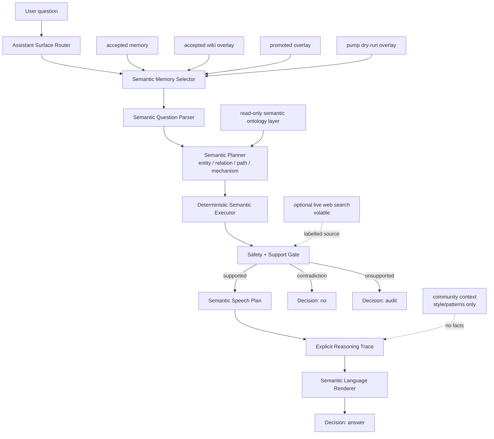
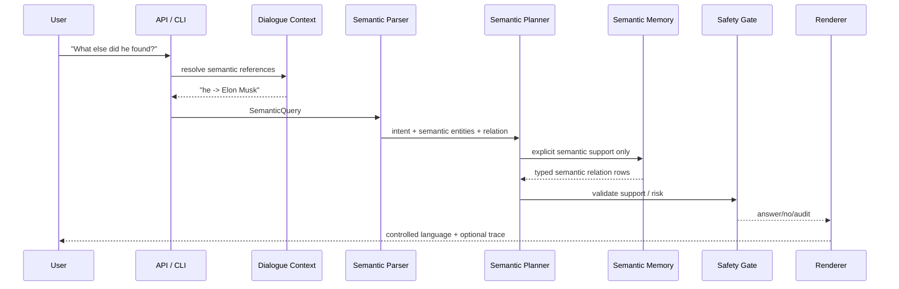
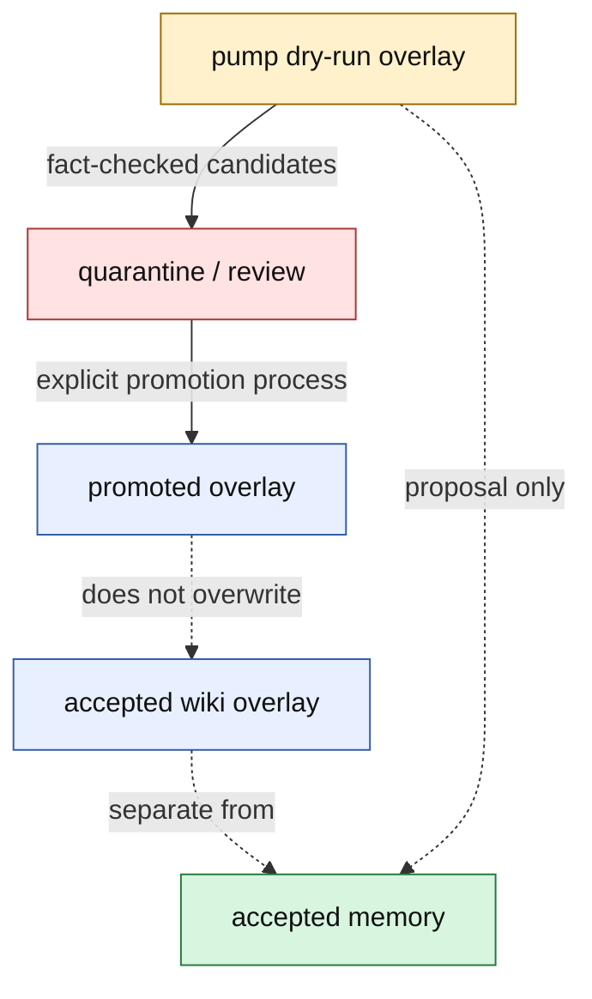
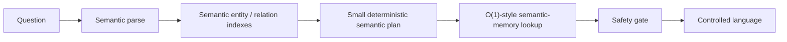

# Microworld

Microworld is an experimental semantic AI architecture with explicit memory,
deterministic reasoning, dialogue state, and a controlled language renderer.
It tests a narrower alternative to the usual LLM stack: semantic memory,
semantic reasoning, semantic dialogue context, and a separately controlled
speech layer instead of one opaque next-token model doing facts, reasoning,
style, and safety at the same time.

The current system is not AGI and not an open-domain replacement for modern
LLMs. It is a bounded explicit-memory AI runtime that answers only when it can
point to controlled semantic memory, says `audit` when support is missing, and
keeps factual support separate from reasoning, dialogue, language style,
community patterns, live search, and session context.

The research question is:

```text
Can useful inference, memory growth, dialogue, controlled language generation,
and trust learning be built from explicit semantic entities, typed relations,
mechanism roles, safety policy, and deterministic planners instead of hidden
model weights?
```

The current answer is stronger than a toy answer bot: inside bounded
explicit-memory domains, the runtime can transform language into semantic
structures, answer, audit, reason over gaps, carry dialogue context, render
controlled English, and hold quality under a 1,000-question deterministic
speech benchmark. The important new result is that the answer surface is now
measured separately from factual coverage: speech can be tested, improved, and
stress-tested without pretending that a phrase model is factual memory.

## Snapshot

Latest speech/reasoning snapshot, from
`worldpgt/experiments/benchmarks/speech_quality_stress_20260708T163840Z.json`:

| Metric | Large suite | Stress suite |
|---|---:|---:|
| Questions | 50 | 1,000 |
| Passed | 50 / 50 | 1,000 / 1,000 |
| Quality rate | 100.0% | 100.0% |
| Honest gap rate | 9 / 9 | 171 / 171 |
| Debug-like output | 0 | 0 |
| Repetitive output | 0 | 0 |
| Decision drift | 0 | 0 |
| Missing required text | 0 | 0 |
| Latency p50 | 4.82 ms | 8.03 ms |
| Latency p95 | 30.43 ms | 29.56 ms |
| Latency p99 | 32.91 ms | 35.77 ms |

The stress suite is a deterministic 1,000-question speech benchmark over known
categories, not 1,000 independent open-domain facts. Its purpose is to measure
the user-facing speech/reasoning surface under load: profiles, thin profiles,
mechanism gaps, direct relations, connection paths, adversarial inversions,
current/live requests, private-info requests, unsupported universal claims, and
style control.

Current community/speech-pattern snapshot, from
`worldpgt/experiments/community_context_v1/reddit_community_summary.json`:

| Artifact | Count / status |
|---|---:|
| Local Reddit/Hacker News-like input records | 371 |
| Accepted community-context items | 371 |
| Cognitive pattern events | 428 |
| Quarantined in final context build | 0 |
| Factual support allowed from community layer | false |
| Accepted/promoted/snapshot overlays modified | false |

The 428 cognitive pattern events are behavior/style patterns, not facts:
`analogy_pattern` 99, `explanation_pattern` 87, `mistake_pattern` 74,
`style_tone_pattern` 69, `question_pattern` 46, `procedure_pattern` 27,
`uncertainty_pattern` 25, and `debugging_pattern` 1.

Current local pump snapshot, from
`worldpgt/experiments/knowledge_pump_v1/pump_summary.json` unless noted:

| Area | Snapshot |
|---|---:|
| Current dry-run overlay file | 8,930 items |
| Pump dry-run overlay, current filtered count | 6,682 items |
| Pump dry-run overlay, with weak links | 27,808 items |
| Pump world-model delta | 6,455 items |
| Pump answerable fact delta | 2,836 facts |
| Pump relation delta | 1,637 relations |
| Pump definition delta | 1,199 definitions |
| Pump entity delta | 3,619 entity cards |
| Pump batches completed | 80 |
| Total fetched pages | 22,620 |
| Fetch successes | 7,120 |
| Frontier titles total | 361,233 titles |
| Dynamic frontier file | 360,685 titles |
| Assistant smoke | 1,325 supported fact answers / 1,360 prompts / 0 wrong |
| Pump fact QA | 1,200 prompts / 0 wrong / 0 unsupported answers |
| Extraction v2 | 4,496 candidates / 4,438 safe deltas |
| Promotion state | proposal-only; trusted memory unchanged |

Performance snapshot from the deterministic speech benchmark:

```text
questions:     1,000
passed:        1,000 / 1,000
honest gaps:   171 / 171
p50 latency:   8.03 ms
p95 latency:   29.56 ms
p99 latency:   35.77 ms
max latency:   95.48 ms
hardware:      local CPU, no GPU/model API at answer time
```

These are local snapshots, not general product benchmarks. The useful signal is
the shape: indexed semantic-memory lookup, deterministic reasoning, and
controlled speech rendering stay fast under the tested 1,000-question load, and
the system can run without a GPU or model API on supported memory-backed
questions.

## Table Of Contents

- [What It Is](#what-it-is)
- [What It Is Not](#what-it-is-not)
- [Semantic-First Design](#semantic-first-design)
- [Text Generation Experiment](#text-generation-experiment)
- [Speech And Reasoning Layer](#speech-and-reasoning-layer)
- [Community Speech And Cognitive Patterns](#community-speech-and-cognitive-patterns)
- [Optional Live Web Search](#optional-live-web-search)
- [Architecture](#architecture)
- [Runtime Inference Flow](#runtime-inference-flow)
- [Knowledge Pump](#knowledge-pump)
- [Memory Boundaries](#memory-boundaries)
- [Safety Model](#safety-model)
- [Question Types](#question-types)
- [Examples](#examples)
- [Dialogue Context Layer](#dialogue-context-layer)
- [Answer Styles](#answer-styles)
- [Speech Quality Benchmarks](#speech-quality-benchmarks)
- [Performance](#performance)
- [Current Artifacts](#current-artifacts)
- [Run It](#run-it)
- [Project Layout](#project-layout)
- [Research Tracks Preserved From Earlier Work](#research-tracks-preserved-from-earlier-work)
- [Research Results](#research-results)
- [Known Limits](#known-limits)
- [Next Work](#next-work)

## What It Is

Microworld stores knowledge as semantic entities, definitions, typed semantic
relations, mechanism/purpose roles, source-qualified snapshots, weak context
links, and policy metadata. A user request is parsed into semantic structure,
planned, executed against the relevant memory layer, routed through
safety/support policy, shaped by semantic dialogue context, rendered, and
validated.

The core behavior is deliberately boring in the best possible way:

```text
supported semantic claim present -> answer
explicit contradiction          -> no
weak/volatile/current gap       -> audit
unknown or unsupported form     -> audit
```

No answer should appear because a model "felt" that it was plausible.

## What It Is Not

- Not a general language model.
- Not an open-domain search engine.
- Not live-current fact answering.
- Not a claim that symbolic systems are generally superior to neural systems.
- Not a trusted-memory auto-promotion pipeline.
- Not a production knowledge graph.
- Not fundamentally a graph database or graph QA engine.

The project explores a complementary path: compact explicit memory and
inspectable trust learning for semantic reasoning, where behavior can be
audited, corrected, compressed, and transferred without retraining neural
weights. Graphs may be used as one storage representation for semantic
structures, but they are not the core abstraction.

## Semantic-First Design

The central abstraction in Microworld is semantics. Text is an interface, not
the internal reasoning substrate.

The motivation is simple: humans do not reason primarily over strings. Humans
reason over meanings: entities, relations, causes, mechanisms, roles, gaps,
intentions, and references. Microworld follows that philosophy in a deliberately
bounded implementation. It does not claim human-level reasoning; it tests
whether useful AI behavior can be built by making the semantic state explicit
and auditable.

The normal path is:

```text
natural language question
  -> semantic parse
  -> semantic entities / relations / mechanism roles
  -> semantic planning and support checks
  -> semantic dialogue reference resolution when needed
  -> semantic speech plan
  -> controlled natural-language rendering
```

Every major layer is phrased in that vocabulary:

| Layer | Semantic role |
|---|---|
| Semantic knowledge representation | entities, definitions, typed relations, mechanisms, source-qualified claims |
| Semantic memory | accepted memory, overlays, proposals, and snapshots that store explicit semantic structures |
| Semantic reasoning | support checks, gap detection, contradiction handling, relation/path/mechanism decisions |
| Semantic dialogue context | explicit state over entities, roles, surfaced relations, topics, and references |
| Semantic reference resolution | deterministic binding of `it`, `he`, `that company`, `the founder`, etc. to entities |
| Semantic planning | conversion from parsed intent into supported lookup, synthesis, path, or audit plans |
| Semantic language generation | rendering an already-supported semantic plan into bounded English |

The graph appears only as an implementation technique for storing or traversing
some semantic structures. A graph edge is useful because it encodes a semantic
relation; the relation is the important object, not the storage shape.

## Text Generation Experiment

Microworld is testing a non-neural approach to language generation over
verified semantic support.

The working principle is:

```text
facts are not generated
speech is generated
```

Instead of predicting the next token from neural weights, the experimental
speech layer can choose the next allowed speech unit from explicit state:

- the user's semantic question
- the current semantic entity
- the verified relations and facts already selected by the planner
- what the answer has already said
- the requested answer style
- deterministic safety and support checks

The goal is LLM-like surface behavior without moving truth into an opaque model.
The generated wording may vary, but every factual claim still has to come from
accepted memory, an accepted overlay, or a clearly labelled proposal/snapshot
source. This is an experiment in controlled text generation, not open-domain
language modeling and not a neural model replacement.

## Speech And Reasoning Layer

The current breakthrough is not that Microworld "knows everything." It does
not. The stronger result is architectural: semantic support, reasoning,
dialogue, and speech are now separate enough to test independently.

```text
semantic memory rows
  -> semantic speech plan
  -> explicit reasoning trace
  -> action plan: answer / answer_with_gap / audit / no
  -> semantic language renderer
  -> surface validator + benchmark metrics
```

The reasoning layer operates over an already-built speech plan. It does not
query raw text, invent facts, or decide truth from phrasing. Its job is to make
the semantic answer decision inspectable:

- detect whether the user is asking for a profile, relation, path, or mechanism
- decompose the task into subgoals
- check whether required evidence roles exist
- name missing evidence, especially mechanism gaps
- choose an action such as `answer`, `answer_with_gap`, or `ask_clarification`
- forbid unsupported claims from entering speech

The speech layer then turns that bounded reasoning state into ordinary English.
It can say a useful partial answer such as "I can identify Starlink, but I do
not yet have the mechanism" without pretending it knows how Starlink works.

Important modules:

| Layer | Code | Role |
|---|---|---|
| Assistant orchestrator | `worldpgt/assistant_surface/answer_orchestrator.py` | routes requests, chooses memory/search/community path, attaches traces |
| Style normalizer | `worldpgt/assistant_surface/answer_style.py` | handles brief/simple/detailed style requests without changing facts |
| Speech planner | `worldpgt/entity_qa/semantic_speech_planner.py` | turns supported semantic facts into roles such as definition, activity, purpose, mechanism |
| Reasoning engine | `worldpgt/cognition/reasoning_engine.py` | builds explicit reasoning trace and action plan |
| Thought loop | `worldpgt/cognition/thought_loop.py` | rejects unsupported direct mechanism answers and accepts gap fallback |
| Deliberation/support guard | `worldpgt/cognition/deliberation_engine.py`, `support_guard.py` | prevents unsupported conclusions |
| Decision speech | `worldpgt/cognition/decision_surface.py` | human-facing phrasing for gaps, thin profiles, and clarification |
| Symbolic speech renderer | `worldpgt/entity_qa/symbolic_text_generator.py` | emits bounded English from the speech plan |
| Phrase transition store | `worldpgt/cognition/phrase_graph.py` | stores deterministic phrase fragments and transitions for rendering |
| Surface selection | `worldpgt/cognition/surface_selection.py` | rejects debug-like/repetitive variants and chooses cleaner speech |
| Semantic thought state | `worldpgt/cognition/semantic_thought_graph.py` | represents task, evidence, gap, and pattern state for cognitive moves |

This is why `How does Starlink work?` can honestly answer with a gap: the
system has enough facts to identify Starlink and its service, but no admitted
mechanism evidence role. The answer is useful because it separates "what I
know" from "what I do not know."

## Community Speech And Cognitive Patterns

Microworld now has a low-trust community layer built from local
Reddit/Hacker News-like records. This layer is deliberately not factual memory.
It is for speech habits, common questions, examples, and reusable cognitive
patterns.

```text
local Reddit/HN-like records
  -> classifier / quarantine
  -> reddit_community_context.json
  -> reddit_speaking_profile.json
  -> cognitive_pattern_events.json
  -> cognitive_pattern_graphs.json  # storage artifact for semantic patterns
```

Current artifact snapshot:

```text
input_records_count:             371
accepted_context_items_count:    371
cognitive_pattern_events_count:  428
factual_support_allowed:         false
accepted_overlay_modified:       false
promoted_overlay_modified:       false
snapshot_dry_run_overlay_modified: false
```

The key safety rule is simple:

```text
community context may shape how an answer is explained
community context may not make a factual claim true
```

That is the same separation as the speech benchmark: learn how people ask,
explain, debug, compare, and handle uncertainty, but keep factual support in
accepted memory, overlays, source-qualified snapshots, or live-search results
that are explicitly labelled as volatile.

## Optional Live Web Search

Microworld also has an optional live-search path for questions that ask for
current or missing information. It is intentionally separate from memory.

```text
current/live question
  -> safety route
  -> optional web search provider
  -> answer extraction / relevance filter
  -> rendered with "live web search, volatile" disclosure
  -> never promoted into accepted memory
```

The default composite provider races Wikipedia, Wikidata, and optional Claude
web search under one deadline. It uses query-intent filtering, source relevance,
temporal checks, and a TTL live cache so repeated entity questions can reuse
retrieved text without treating it as trusted memory.

This path is useful, but it is not the same achievement as the controlled
speech/reasoning layer. The latest saved WebQuestions-style open benchmark is
still weak and intentionally documented as experimental:

```text
external_20260706T203034Z.json
total_questions: 250
answer_rate:     42.0%
audit_rate:      58.0%
precision:       28.57% among answered rows
elapsed:         1878.23s
```

So the honest status is: live search exists, is safer than a generic fallback,
and is improving, but it is not yet a strong open-domain inference result.

## Architecture

At the top level, the runtime is no longer just an answer surface:

```text
Text -> Semantic Structures -> Semantic Reasoning -> Semantic Dialogue Context
     -> Semantic Language Renderer -> Answer
```

Semantic memory, reasoning, dialogue, and speech stay separate so each layer
can be measured, audited, and improved without silently changing the others.
Storage may be tabular JSON, overlay rows, indexes, or graph-shaped structures;
the runtime contract is semantic, not storage-specific.



The high-level modules are:

| Layer | Code |
|---|---|
| Assistant surface | `worldpgt/assistant_surface/` |
| Web/API UI | `worldpgt/api/` |
| Semantic dialogue context | `worldpgt/dialogue/` |
| Semantic reasoning and speech planning | `worldpgt/cognition/`, `worldpgt/entity_qa/semantic_speech_planner.py` |
| Community speech/cognitive patterns | `worldpgt/community_context/` |
| Optional live search | `worldpgt/web_search/` |
| Semantic entity inference | `worldpgt/entity_qa/` |
| Semantic query primitives | `worldpgt/query_engine/` |
| Multi-hop semantic reasoning | `worldpgt/multihop_qa/` |
| Relation extraction | `worldpgt/relation_extraction_v2/` |
| Knowledge pump | `worldpgt/knowledge_pump/` |
| Pump artifacts | `worldpgt/experiments/knowledge_pump_v1/` |
| Safety and temporal policy | `worldpgt/knowledge/`, `worldpgt/relation_extraction_v2/relation_policy.py` |

## Runtime Inference Flow



The parser currently recognizes relation lookup, inverse lookup, comparative
questions, `is_a` traversal, count, filtered lookup, path/connection questions,
and open synthesis.

## Knowledge Pump

The Knowledge Pump is the proposal-only learning loop. It fetches or reads
candidate pages, extracts semantic claims, filters them through precision gates,
tests them through fact checks, and writes proposal overlays. It does not mutate
trusted accepted memory.


The pump has three feedback loops:

| Loop | What happens |
|---|---|
| Yield-ranked frontier | Previous batches teach the fetcher which titles are likely to produce answerable semantic claims. |
| Dynamic frontier | Newly fetched pages expose internal Wikipedia links; the frontier grows organically. |
| Audit -> gap -> frontier | `Decision: audit` rows become structured gap signals for future acquisition. |

Recent pump state:

```text
batches_completed:                   80
frontier_titles_total:               361233
dynamic_frontier_file_total:         360685
fetched_count_total:                 22620
fetch_success_count_total:           7120
extraction_yield_v2_candidate_count: 4496
pump_answerable_fact_delta_count:    2836
pump_smoke_wrong_count:              0
```

## Memory Boundaries

This boundary is the heart of the project. Proposal artifacts are useful, but
they are not silently promoted into trusted semantic memory.

| Bucket | Artifact | Meaning |
|---|---|---|
| Accepted memory | `worldpgt/experiments/accepted_knowledge_memory_v1.json` | Trusted explicit semantic memory. |
| Accepted wiki overlay | `worldpgt/experiments/accepted_wiki_memory_overlay_v1.json` | Isolated wiki semantic-memory overlay. |
| Promoted overlay | `worldpgt/experiments/self_ingestion_v1/promotion/promoted_wiki_memory_overlay_v1.json` | Separate promoted artifact, not accepted memory. |
| Pump dry-run overlay | `worldpgt/experiments/knowledge_pump_v1/pump_dry_run_overlay.json` | Proposal overlay for runtime experiments. |
| Weak context | weak links inside overlays | Contextual association only, never a stable fact. |
| Ontology layer | `wikidata_p279_ontology_layer.json` | Read-only `is_a` traversal support. |



## Safety Model

Microworld prefers an honest gap over a plausible unsupported answer.

Safety gates block:

- current/live facts without an accepted source-qualified snapshot
- private or sensitive data
- relation inversion
- unsupported universal claims
- weak context promoted to fact
- volatile facts used as stable/current truth
- current-sensitive predicates used as multi-hop bridges
- unsupported entity categories
- ambiguous dialogue references

Temporal policy:

| Class | Meaning |
|---|---|
| `historical` | Stable once verified, e.g. founding events. |
| `semi_stable` | Can change, but usually not minute-to-minute, e.g. ownership or products. |
| `snapshot` | Source-qualified dated value, e.g. net worth estimate. |
| `volatile` | Current-sensitive, must be hedged or audited. |

Optional relation-label similarity exists for parser fallback, but there is no
embedding-based answer generation and no neural renderer.

## Question Types

Microworld currently handles these controlled forms:

| Type | Example |
|---|---|
| Direct fact | `Who founded SpaceX?` |
| Inverse relation | `What did Elon Musk found?` |
| Entity synthesis | `Tell me about SpaceX.` |
| Mechanism-ish synthesis | `How does Starlink work?` |
| Count | `How many companies did Elon Musk found?` |
| Comparative | `Who founded more companies, Musk or Bezos?` |
| Multi-hop path | `How is Starlink connected to Falcon 9?` |
| Ontology traversal | `Is Elon Musk a worker?` |
| Contradiction | `Is SpaceX a person?` |
| Source-qualified snapshot | `According to Forbes, what is Elon Musk's estimated net worth?` |
| Dialogue follow-up | `What else did he found?` |
| Style control | `коротко про SpaceX` |

## Examples

These are representative examples from the controlled runtime surface. Exact wording
can change as renderers improve.

```text
Q: Who founded SpaceX?
A: SpaceX was founded by Elon Musk.
```

```text
Q: Tell me about SpaceX.
A: SpaceX is an aerospace manufacturer and space transportation company. It
   develops rockets, spacecraft, and launch vehicles, produces Falcon rockets
   and Dragon spacecraft, and was founded by Elon Musk.
```

```text
Q: How is Starlink connected to Falcon 9?
A: Starlink is connected to Falcon 9 through SpaceX: Starlink is owned by
   SpaceX, and SpaceX develops Falcon 9.
```

```text
Q: Is SpaceX a person?
A: No. SpaceX is known to be an aerospace manufacturer, which contradicts a
   person.
```

```text
Q: What is the current CEO of SpaceX?
A: audit. This asks for current/live data, and no current source-qualified
   snapshot is available in Microworld's memory.
```

The latest explanatory extraction layer can now produce mechanism/purpose
relations such as:

```text
Starlink provides satellite internet access.
Starlink uses low Earth orbit satellites to reduce latency.
Starlink enables broadband access in remote areas.
Starlink works by routing traffic through satellites.
Falcon 9 is used for orbital launches.
```

Once those facts are present in the active overlay, `How does Starlink work?`
can render mechanism-first instead of only saying that operational details are
missing.

## Dialogue Context Layer

Dialogue context is a core architectural layer, not a hidden chat log. It is
explicit semantic state over canonical entities, answer roles, surfaced
relations, topics, and reference bindings. The layer exists so a multi-turn
question can be reduced to the same kind of inspectable semantic query as a
single-turn question.

This state is not model memory. It contains pointers into known entities and
turn records, not new facts. It never writes accepted memory, never promotes an
overlay row, and never makes a trusted claim true. A reference such as `it`,
`he`, `that company`, `the founder`, or `the other one` is resolved over
semantic entities and dialogue roles, not over nearby text.

The current dialogue path is intentionally deterministic:

- `DialogueState` is the only session memory for the v2 layer.
- `TurnRecord` is the only input that mutates `DialogueState`.
- `resolve_question(question, state, index)` is a pure resolver step before
  semantic parsing.
- Candidate selection uses hard type gates, integer salience scores, and a
  required margin.
- Every slot resolution carries candidates, score breakdowns, strategy, margin,
  and outcome.
- Every decision has an explanation: integer candidate scores plus the
  resolution trace that produced them.
- If any required slot is ambiguous or missing, the whole question audits.
- Topic shifts are explicit `topic_op` changes such as `("set", "Tesla")`.
- State is serializable with `to_dict()` / `from_dict()` and replayable from
  the committed turn records.
- The language renderer receives an already-resolved question or an audit. It
  does not decide reference identity.

The important boundary is semantic: dialogue context may select which existing
entity a later question refers to, but it may not create a fact about that
entity. When the resolver needs role evidence, it uses a narrow read-only
semantic role lookup only to choose among already-known dialogue candidates.
That lookup is trace-marked; it is not a write path.

Example dialogue:

```text
Q1: Tell me about SpaceX.
State: topic_op=("set", "SpaceX")
A1: SpaceX is an aerospace manufacturer and space transportation company.

Q2: Who founded it?
Resolution:
  slot "it" -> SpaceX
  candidates:
    SpaceX total=191
      active_topic=100, last_answer_entity=40, last_question_subject=30,
      user_named=15, mentions=6
  margin: single typed candidate
  strategy: salience
A2: SpaceX was founded by Elon Musk.
State:
  surfaced relation: (SpaceX, founded_by, Elon Musk)
  role: Elon Musk entered as founded_by(SpaceX)
  active topic remains SpaceX

Q3: Tell me about Elon Musk.
State: topic_op=("set", "Elon Musk")
A3: Elon Musk is a businessman and entrepreneur.

Q4: What else did he found?
Resolution:
  slot "he" -> Elon Musk
  candidates:
    Elon Musk total=191
      active_topic=100, last_answer_entity=40, last_question_subject=30,
      user_named=15, mentions=6
  margin: single typed candidate
  strategy: salience
  exclusion: already surfaced SpaceX for founded_by
A4: Elon Musk founded Tesla, Neuralink, The Boring Company, xAI, Zip2, and Big Green.

Q5: What about Tesla?
Resolution:
  topic_shift "Tesla" -> Tesla
  reformulated question: Tell me about Tesla.
State: topic_op=("set", "Tesla"), previous_topic="Elon Musk"
A5: Tesla is an automotive and clean energy company.

Q6: Who founded it?
Resolution:
  slot "it" -> Tesla
  candidates:
    Tesla total=191
      active_topic=100, last_answer_entity=40, last_question_subject=30,
      user_named=15, mentions=6
  margin: single typed candidate
  strategy: salience
A6: Tesla was founded by Elon Musk, Martin Eberhard, Marc Tarpenning, JB
    Straubel, and Ian Wright.
```

The chain is `SpaceX -> it -> Elon Musk -> he -> Tesla -> it`, but the topic
does not move through hidden memory. It changes only when a committed turn says
so: first `SpaceX`, then `Elon Musk`, then `Tesla`.

Ambiguity produces an audit rather than a best guess:

```text
Q: Tell me about OpenAI.
A: OpenAI was founded by Sam Altman, Greg Brockman, Ilya Sutskever,
   John Schulman, Wojciech Zaremba, and Elon Musk.

Q: What did he found?
Resolution:
  slot "he" -> unresolved
  candidates:
    Elon Musk total=43
      last_answer_entity=40, mentions=3
    Greg Brockman total=43
      last_answer_entity=40, mentions=3
    Ilya Sutskever total=43
      last_answer_entity=40, mentions=3
    John Schulman total=43
      last_answer_entity=40, mentions=3
    Sam Altman total=43
      last_answer_entity=40, mentions=3
    Wojciech Zaremba total=43
      last_answer_entity=40, mentions=3
  margin: 0, below required threshold
A: audit. unresolved_dialogue_reference
```

The migration path is also explicit. `MICROWORLD_DIALOGUE_V2=shadow` runs the
new `DialogueState` resolver and commit logic in parallel with the older
serving behavior so divergences are logged before the new path drives answers.
The deterministic dialogue benchmark checks zero false resolutions, stable
trace output across repeated runs, and `DialogueState.replay(records) ==
live_state` after each session. Compatibility tests keep single-turn QA
byte-identical when no dialogue slot is present, so adding dialogue context does
not change the ordinary one-question path.

## Answer Styles

The renderer supports lightweight style hints. These do not change facts; they
only change selection and phrasing.

```text
коротко про SpaceX
самое важное про Tesla
простыми словами How does Starlink work?
подробнее про Elon Musk
```

Example:

```text
Q: коротко про SpaceX
A: SpaceX is an aerospace manufacturer and space transportation company. It
   develops rockets, spacecraft, and launch vehicles.
```

## Speech Quality Benchmarks

`benchmark_speech_quality_v1.py` measures the answer surface, not factual
coverage. It treats the semantic planner as an explicit-memory lookup and
checks whether speech stays natural, honest about gaps, non-repetitive, and
free of debug/internal wording.

It records row-level diagnostics:

```text
question
decision / route / support_kind / source_system
answer_text
latency_ms
debug_like
repetitive
honest_gap
decision_mismatch
missing_required_text
flags
```

Current suites:

| Suite | Purpose | Questions | Result |
|---|---|---:|---:|
| `smoke` | fast contract check | 12 | green |
| `large` | broad speech/reasoning baseline | 50 | 50 / 50 |
| `stress` | deterministic load/stability suite | 1,000 | 1,000 / 1,000 |

Stress category coverage:

| Category | Passed |
|---|---:|
| profile | 304 / 304 |
| direct_relation | 162 / 162 |
| mechanism_gap | 114 / 114 |
| adversarial | 72 / 72 |
| missing_or_current | 72 / 72 |
| thin_profile | 57 / 57 |
| style_control | 57 / 57 |
| connection | 54 / 54 |
| private_info | 54 / 54 |
| unsupported_universal | 54 / 54 |

Reproduce:

```bash
python3 -m worldpgt.experiments.benchmark_speech_quality_v1 --suite large
python3 -m worldpgt.experiments.benchmark_speech_quality_v1 --suite stress
python3 -m pytest worldpgt/tests/test_benchmark_speech_quality_v1.py -q
```

Saved report:

```text
worldpgt/experiments/benchmarks/speech_quality_stress_20260708T163840Z.json
```

## Performance

Microworld's hot path is mostly indexed semantic-memory lookup, deterministic
planning, dialogue/context routing, and small renderer passes. It has no GPU
dependency and does not call a model API at answer time.



Deterministic speech-renderer benchmark snapshot:

| Metric | Value |
|---|---:|
| questions | 1,000 |
| passed | 1,000 / 1,000 |
| quality_rate | 100.0% |
| honest_gap_rate | 171 / 171 |
| mean latency | 14.38 ms |
| p50 latency | 8.03 ms |
| p95 latency | 29.56 ms |
| p99 latency | 35.77 ms |
| max latency | 95.48 ms |
| debug-like output | 0 |
| repetitive output | 0 |
| decision drift | 0 |

This benchmark measures the answer-surface runtime under deterministic
categories, including profile answers, direct relations, mechanism gaps,
connection paths, adversarial inversions, current/live requests, private-info
requests, unsupported universal claims, and style control. Treat it as a
workload-specific runtime result, not a universal benchmark: it applies when the
question can be handled by Microworld's explicit memory/reasoning/speech path
and does not need open-domain generation.

## Current Artifacts

Core status files:

```text
worldpgt/experiments/benchmark_speech_quality_v1.py
worldpgt/experiments/benchmarks/speech_quality_large_20260708T162944Z.json
worldpgt/experiments/benchmarks/speech_quality_stress_20260708T163840Z.json
worldpgt/experiments/community_context_v1/reddit_community_summary.json
worldpgt/experiments/community_context_v1/reddit_community_context.json
worldpgt/experiments/community_context_v1/reddit_speaking_profile.json
worldpgt/experiments/community_context_v1/cognitive_pattern_events.json
worldpgt/experiments/community_context_v1/cognitive_pattern_graphs.json
worldpgt/experiments/benchmarks/external_20260706T203034Z.json
worldpgt/experiments/knowledge_pump_v1/pump_summary.json
worldpgt/experiments/knowledge_pump_v1/pump_fact_qa_v1/pump_fact_qa_summary.json
worldpgt/experiments/knowledge_pump_v1/assistant/assistant_surface_summary.json
worldpgt/experiments/knowledge_pump_v1/extraction_yield_v2/extraction_yield_v2_summary.json
worldpgt/experiments/knowledge_pump_v1/promotion_readiness_audit_v1/promotion_readiness_summary.json
worldpgt/docs/CURRENT_IMPLEMENTATION_AUDIT.md
worldpgt/docs/SAFETY_MODEL.md
```

Important note: `pump_summary.json` can preserve stale QA fields after a pump
run. When reporting QA precision or prompt counts, prefer the dedicated
`pump_fact_qa_v1/pump_fact_qa_summary.json` artifact unless the summary says QA
is current.

## Run It

CLI:

```bash
python3 worldpgt/experiments/ask_microworld_v1.py \
  --overlay pump-dry-run \
  --enable-multihop \
  "Who founded SpaceX?"
```

Interactive session with dialogue context:

```bash
python3 worldpgt/experiments/ask_microworld_v1.py \
  --overlay pump-dry-run \
  --enable-multihop \
  --interactive
```

Web UI / API:

```bash
python3 -m worldpgt.api.server --overlay pump-dry-run --port 8000
# open http://localhost:8000
```

Knowledge pump batch:

```bash
python3 worldpgt/experiments/run_knowledge_pump_v1.py \
  --enable-spacy \
  --allow-network \
  --frontier-policy yield-ranked
```

Speech/reasoning benchmark:

```bash
python3 -m worldpgt.experiments.benchmark_speech_quality_v1 --suite stress
```

Community pattern pump:

```bash
python3 -m worldpgt.experiments.run_reddit_community_pump_v1
```

Open WebQuestions-style benchmark with optional live search:

```bash
python3 -m worldpgt.experiments.benchmark_external_v1 \
  --overlay pump-dry-run \
  --web-search
```

Gap-driven audit runner:

```bash
python3 worldpgt/experiments/run_audit_driven_pump_v1.py \
  --period-days 1
```

Focused tests for the most recent runtime/extraction layers:

```bash
python3 -m pytest \
  worldpgt/tests/test_relation_policy_and_patterns.py \
  worldpgt/tests/test_assistant_surface_v1.py \
  worldpgt/tests/test_synthesis_layer_v1.py \
  worldpgt/tests/test_dialogue_coreference.py \
  -q

python3 -m pytest worldpgt/tests/test_knowledge_pump_extraction_yield_v2.py -q
python3 -m pytest worldpgt/tests/test_benchmark_speech_quality_v1.py -q
```

Recent focused validation:

```text
141 passed  # assistant surface + synthesis + speech benchmark focused set
16 passed   # benchmark_speech_quality_v1 test file
```

## Project Layout

```text
worldpgt/
  api/                    FastAPI server and static UI
  assistant_surface/      orchestrator, router, context selector, styles
  cognition/              reasoning traces, thought loop, semantic moves, phrase storage
  community_context/      Reddit/HN-style context and semantic pattern memory
  dialogue/               semantic dialogue state and reference resolution
  entity_qa/              semantic parser, analyzer, planner, renderer, synthesis
  web_search/             optional volatile live-search providers and cache
  query_engine/           semantic Find, Filter, Count, Compare, Traverse, Classify
  multihop_qa/            explicit semantic relation-chain reasoning
  cross_page_qa/          controlled cross-page connection QA
  relation_extraction_v2/ relation policy, patterns, validators
  knowledge_pump/         extraction yield, precision gates, frontier logic
  knowledge/              entity types, staleness, ontology helpers
  pump_fact_qa/           generated fact-QA checks for pump outputs
  experiments/            runners, artifacts, overlays, reports
  docs/                   implementation audit, safety model, overlay notes
```

## Research Tracks Preserved From Earlier Work

The repository also contains earlier Microworld research tracks around:

- ConceptNet-derived relation prediction
- pattern discovery
- transitive and mixed-pattern reasoning
- relation trust
- audit-driven trust learning
- feedback compression
- suppression policy
- name/surname generation
- GPT-2 comparison reports
- risk/coverage benchmarks

Those results remain part of the project history. The current README foregrounds
the `worldpgt` explicit-memory runtime because that is the active path.

## Research Results

Demonstrated in the current repository and preserved research artifacts:

- ✓ Audit-driven trust learning
- ✓ Trust transfer on unseen data
- ✓ Feedback compression (1598x)
- ✓ Deterministic speech renderer
- ✓ 1,000-question deterministic benchmark
- ✓ 100% honest-gap behavior on the stress suite
- ✓ Dialogue context and conservative coreference
- ✓ Controlled language generation over explicit support
- ✓ Local runtime latency (8.03ms p50 on the speech stress suite)
- ✓ Scalable indexed semantic retrieval
- ✓ Multi-hop explicit semantic reasoning
- ✓ Speech/reasoning surface measured separately from factual coverage
- ✓ Reddit/HN-style cognitive pattern memory that is blocked from factual support
- ✓ Optional live-search path with volatile/source-labelled answers

Not demonstrated:

- Open-domain general inference
- General intelligence
- Neural model replacement
- Open-domain live-search precision competitive with modern LLM search tools

## Known Limits

- The active system is a controlled explicit-memory inference runtime, not
  open-domain general intelligence.
- Extraction recall is limited by deterministic patterns and optional spaCy.
- Entity identity is still surface/alias based, not QID-native.
- Cross-sentence extraction coreference is intentionally conservative.
- Live/current facts audit unless a dated source-qualified fact exists.
- Live web search is optional, volatile, and currently weaker than the
  controlled memory-backed path on open WebQuestions-style evaluation.
- Pump outputs are proposal artifacts until explicitly promoted.
- Weak context links are not answerable facts.
- Speech stress results are over deterministic benchmark categories, not proof
  of arbitrary conversational generalization.
- Renderer quality is improving but still deterministic and bounded.
- Reddit/HN community context teaches speech and cognitive patterns, not facts.
- No autonomous trusted-memory promotion exists yet.
- No durable scheduler service exists for night cycles; loops are script-driven.

These limits are not footnotes. They are part of the safety model.

## Next Work

Highest-leverage next steps:

1. Regenerate the pump dry-run overlay after the new explanatory predicates
   (`provides`, `uses`, `enables`, `used_for`, `works_by`) so mechanism answers
   appear in the UI.
2. Rerun pump fact QA after overlay regeneration so summary counts stop drifting.
3. Add a repeated latency benchmark artifact with median/min/max and workload
   description.
4. Expand the 1,000-question stress benchmark with more paraphrase families,
   then keep row-level failure diagnostics as the work queue.
5. Connect cognitive pattern events more deeply to semantic reasoning moves while
   keeping `factual_support_allowed=false`.
6. Improve live-search precision before presenting it as a serious open-domain
   result.
7. Expand mechanism/purpose extraction carefully, one relation family at a time.
8. Add QID-native identity to reduce alias and homonym collisions.
9. Keep promotion explicit: proposal -> fact checks -> review -> promoted artifact, never
   silent accepted-memory mutation.

## Status

Experimental, local, deterministic, and intentionally conservative. The point
is not to beat language models at language. The point is to build a small world
where memory, trust, policy, and reasoning are inspectable enough that every
answer has a visible reason to exist.
