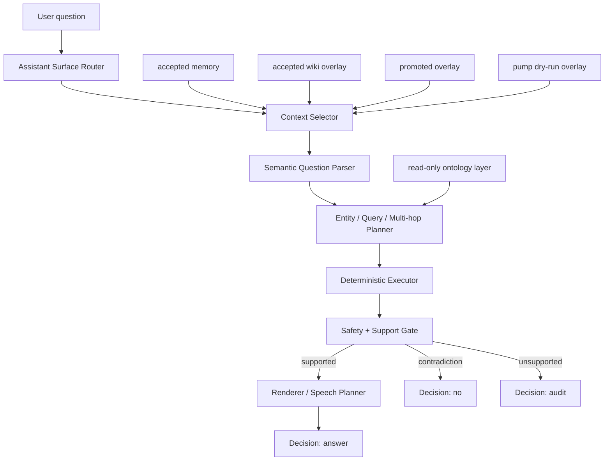
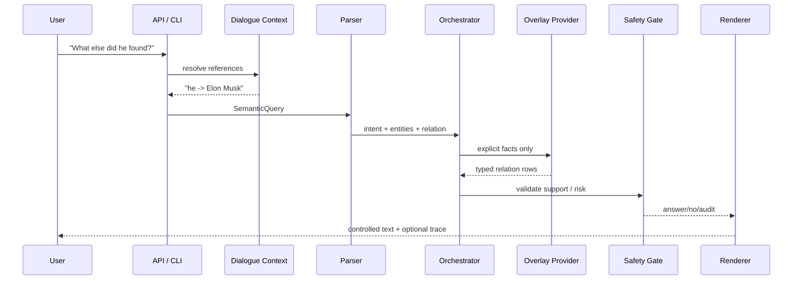

# Microworld

Microworld is testing a narrower approach to AI: explicit memory, explicit
reasoning, and controlled text generation instead of opaque next-token
prediction.

The current system is not AI in general. It is not an LLM replacement, does not
claim open-domain understanding, and should be read as a bounded research
system: a local, auditable QA engine that answers only when it can point to
controlled memory, and audits when the question would require unsupported
inference, live data, or unsafe promotion of weak context.

The research question is:

```text
Can useful QA, memory growth, dialogue, and trust learning be built from
explicit facts, typed relations, safety policy, and deterministic planners
instead of hidden model weights?
```

The current answer is: partially yes, inside bounded explicit-memory domains.

## Snapshot

Current local pump snapshot, from
`worldpgt/experiments/knowledge_pump_v1/pump_summary.json` unless noted:

| Area | Snapshot |
|---|---:|
| Pump dry-run overlay, no weak links | 4,674 items |
| Pump dry-run overlay, with weak links | 20,241 items |
| Pump world-model delta | 4,447 items |
| Pump answerable fact delta | 2,141 facts |
| Pump relation delta | 1,398 relations |
| Pump definition delta | 743 definitions |
| Pump entity delta | 2,306 entity cards |
| Pump batches completed | 80 |
| Total fetched pages | 11,717 |
| Fetch successes | 4,239 |
| Frontier titles total | 182,010 titles |
| Dynamic frontier total | 179,499 titles |
| Assistant smoke | 995 supported fact answers / 1,014 prompts / 0 wrong |
| Pump fact QA | 1,200 prompts / 0 wrong / 0 unsupported answers |
| Extraction v2 | 2,944 candidates from 2,357 docs |
| Promotion readiness | 152 QA-covered candidates, proposal-only |

Performance snapshot supplied with this README update:

```text
p50 latency:   8.3 ms
p95 latency:   13.6 ms
throughput:    120 requests/sec
memory:        ~8 MB overlay, ~124 MB RSS
hardware:      Apple M1, 8 GB RAM, no GPU
10x data:      8.7 ms latency (+5%)
```

These are local snapshots, not a general product benchmark. The useful signal
is the shape: indexed explicit-memory lookup stays close to constant-time for
the tested overlay scale, runs offline, and does not need a GPU or API calls.

## Table Of Contents

- [What It Is](#what-it-is)
- [What It Is Not](#what-it-is-not)
- [Text Generation Experiment](#text-generation-experiment)
- [Architecture](#architecture)
- [Runtime QA Flow](#runtime-qa-flow)
- [Knowledge Pump](#knowledge-pump)
- [Memory Boundaries](#memory-boundaries)
- [Safety Model](#safety-model)
- [Question Types](#question-types)
- [Examples](#examples)
- [Dialogue](#dialogue)
- [Answer Styles](#answer-styles)
- [Performance](#performance)
- [Current Artifacts](#current-artifacts)
- [Run It](#run-it)
- [Project Layout](#project-layout)
- [Research Tracks Preserved From Earlier Work](#research-tracks-preserved-from-earlier-work)
- [Research Results](#research-results)
- [Known Limits](#known-limits)
- [Next Work](#next-work)

## What It Is

Microworld stores knowledge as explicit entities, definitions, typed relations,
source-qualified snapshots, weak context links, and policy metadata. A question
is parsed into a structured intent, planned, executed against the relevant
overlay, rendered, and validated.

The core behavior is deliberately boring in the best possible way:

```text
supported fact present       -> answer
explicit contradiction       -> no
weak/volatile/current gap    -> audit
unknown or unsupported form  -> audit
```

No answer should appear because a model "felt" that it was plausible.

## What It Is Not

- Not a general language model.
- Not an open-domain search engine.
- Not live-current QA.
- Not a claim that symbolic systems are generally superior to neural systems.
- Not a trusted-memory auto-promotion pipeline.
- Not a production knowledge graph.

The project explores a complementary path: compact explicit memory and
inspectable trust learning for graph-style reasoning, where behavior can be
audited, corrected, compressed, and transferred without retraining neural
weights.

## Text Generation Experiment

Microworld is testing a non-neural approach to text generation over verified
facts.

The working principle is:

```text
facts are not generated
speech is generated
```

Instead of predicting the next token from neural weights, the experimental
speech layer can choose the next allowed speech unit from explicit state:

- the user's question
- the current entity
- the verified facts already selected by the planner
- what the answer has already said
- the requested answer style
- deterministic safety and support checks

The goal is LLM-like surface behavior without moving truth into an opaque model.
The generated wording may vary, but every factual claim still has to come from
accepted memory, an accepted overlay, or a clearly labelled proposal/snapshot
source. This is an experiment in controlled text generation, not open-domain
language modeling and not a neural model replacement.

## Architecture



The high-level modules are:

| Layer | Code |
|---|---|
| Assistant surface | `worldpgt/assistant_surface/` |
| Web/API UI | `worldpgt/api/` |
| Dialogue context | `worldpgt/dialogue/` |
| Entity QA | `worldpgt/entity_qa/` |
| Query primitives | `worldpgt/query_engine/` |
| Multi-hop QA | `worldpgt/multihop_qa/` |
| Relation extraction | `worldpgt/relation_extraction_v2/` |
| Knowledge pump | `worldpgt/knowledge_pump/` |
| Pump artifacts | `worldpgt/experiments/knowledge_pump_v1/` |
| Safety and temporal policy | `worldpgt/knowledge/`, `worldpgt/relation_extraction_v2/relation_policy.py` |

## Runtime QA Flow



The parser currently recognizes relation lookup, inverse lookup, comparative
questions, `is_a` traversal, count, filtered lookup, path/connection questions,
and open synthesis.

## Knowledge Pump

The Knowledge Pump is the proposal-only learning loop. It fetches or reads
candidate pages, extracts facts, filters them through precision gates, tests
them through QA, and writes proposal overlays. It does not mutate trusted
accepted memory.


The pump has three feedback loops:

| Loop | What happens |
|---|---|
| Yield-ranked frontier | Previous batches teach the fetcher which titles are likely to produce answerable facts. |
| Dynamic frontier | Newly fetched pages expose internal Wikipedia links; the frontier grows organically. |
| Audit -> gap -> frontier | `Decision: audit` rows become structured gap signals for future acquisition. |

Recent pump state:

```text
batches_completed:                   80
frontier_titles_total:               182010
dynamic_frontier_total:              179499
new_ready_docs_this_batch:           2357
extraction_yield_v2_candidate_count: 2944
pump_answerable_fact_delta_count:    2141
pump_smoke_wrong_count:              0
```

## Memory Boundaries

This boundary is the heart of the project. Proposal artifacts are useful, but
they are not silently promoted into trusted memory.

| Bucket | Artifact | Meaning |
|---|---|---|
| Accepted memory | `worldpgt/experiments/accepted_knowledge_memory_v1.json` | Trusted explicit QA memory. |
| Accepted wiki overlay | `worldpgt/experiments/accepted_wiki_memory_overlay_v1.json` | Isolated wiki QA overlay. |
| Promoted overlay | `worldpgt/experiments/self_ingestion_v1/promotion/promoted_wiki_memory_overlay_v1.json` | Separate promoted artifact, not accepted memory. |
| Pump dry-run overlay | `worldpgt/experiments/knowledge_pump_v1/pump_dry_run_overlay.json` | Proposal overlay for QA experiments. |
| Weak context | weak links inside overlays | Contextual association only, never a stable fact. |
| Ontology layer | `wikidata_p279_ontology_layer.json` | Read-only `is_a` traversal support. |


## Safety Model

Microworld prefers an honest gap over a plausible unsupported answer.

Safety gates block:

- current/live facts without an accepted source-qualified snapshot
- private or sensitive data
- relation inversion
- unsupported universal claims
- weak context promoted to fact
- volatile facts used as stable/current truth
- current-sensitive predicates used as multi-hop bridges
- unsupported entity categories
- ambiguous dialogue references

Temporal policy:

| Class | Meaning |
|---|---|
| `historical` | Stable once verified, e.g. founding events. |
| `semi_stable` | Can change, but usually not minute-to-minute, e.g. ownership or products. |
| `snapshot` | Source-qualified dated value, e.g. net worth estimate. |
| `volatile` | Current-sensitive, must be hedged or audited. |

Optional relation-label similarity exists for parser fallback, but there is no
embedding-based answer generation and no neural renderer.

## Question Types

Microworld currently handles these controlled forms:

| Type | Example |
|---|---|
| Direct fact | `Who founded SpaceX?` |
| Inverse relation | `What did Elon Musk found?` |
| Entity synthesis | `Tell me about SpaceX.` |
| Mechanism-ish synthesis | `How does Starlink work?` |
| Count | `How many companies did Elon Musk found?` |
| Comparative | `Who founded more companies, Musk or Bezos?` |
| Multi-hop path | `How is Starlink connected to Falcon 9?` |
| Ontology traversal | `Is Elon Musk a worker?` |
| Contradiction | `Is SpaceX a person?` |
| Source-qualified snapshot | `According to Forbes, what is Elon Musk's estimated net worth?` |
| Dialogue follow-up | `What else did he found?` |
| Style control | `коротко про SpaceX` |

## Examples

These are representative examples from the controlled QA surface. Exact wording
can change as renderers improve.

```text
Q: Who founded SpaceX?
A: SpaceX was founded by Elon Musk.
```

```text
Q: Tell me about SpaceX.
A: SpaceX is an aerospace manufacturer and space transportation company. It
   develops rockets, spacecraft, and launch vehicles, produces Falcon rockets
   and Dragon spacecraft, and was founded by Elon Musk.
```

```text
Q: How is Starlink connected to Falcon 9?
A: Starlink is connected to Falcon 9 through SpaceX: Starlink is owned by
   SpaceX, and SpaceX develops Falcon 9.
```

```text
Q: Is SpaceX a person?
A: No. SpaceX is known to be an aerospace manufacturer, which contradicts a
   person.
```

```text
Q: What is the current CEO of SpaceX?
A: audit. This asks for current/live data, and no current source-qualified
   snapshot is available in Microworld's memory.
```

The latest explanatory extraction layer can now produce mechanism/purpose
relations such as:

```text
Starlink provides satellite internet access.
Starlink uses low Earth orbit satellites to reduce latency.
Starlink enables broadband access in remote areas.
Starlink works by routing traffic through satellites.
Falcon 9 is used for orbital launches.
```

Once those facts are present in the active overlay, `How does Starlink work?`
can render mechanism-first instead of only saying that operational details are
missing.

## Dialogue

Dialogue state is in memory for the current process/session only. It is not
written into accepted memory.

```text
Q: Tell me about Blue Origin.
A: Blue Origin is an American aerospace company. It develops rockets and
   spacecraft, and was founded by Jeff Bezos.

Q: а кто основал?
A: Blue Origin was founded by Jeff Bezos.

Q: а Starlink?
A: Starlink is a satellite internet constellation operated by SpaceX. It is
   owned by SpaceX, and is classified as satellite internet and satellite
   constellation.
```

Coreference is conservative:

```text
Q: Tell me about Elon Musk.
A: Elon Musk is a businessman...

Q: What else did he found?
Resolved: he -> Elon Musk
A: Elon Musk founded SpaceX, Neuralink, The Boring Company, xAI, Zip2, and Big Green.
```

If a reference cannot be resolved, the system audits instead of guessing.

## Answer Styles

The renderer supports lightweight style hints. These do not change facts; they
only change selection and phrasing.

```text
коротко про SpaceX
самое важное про Tesla
простыми словами How does Starlink work?
подробнее про Elon Musk
```

Example:

```text
Q: коротко про SpaceX
A: SpaceX is an aerospace manufacturer and space transportation company. It
   develops rockets, spacecraft, and launch vehicles.
```

## Performance

Microworld's hot path is mostly indexed lookup, deterministic planning, and
small renderer passes. It has no GPU dependency and does not call a model API
at answer time.


Local benchmark snapshot supplied with this README update:

| Metric | Value |
|---|---:|
| p50 latency | 8.3 ms |
| p95 latency | 13.6 ms |
| throughput | 120 req/sec |
| overlay memory | ~8 MB |
| process RSS | ~124 MB |
| hardware | Apple M1, 8 GB RAM |
| GPU | none |
| 10x data latency | 8.7 ms (+5%) |

The attached comparison snapshot estimates roughly `97x` lower latency than a
GPT-4 API round trip on the tested bounded QA workload. The same estimate puts
a local single-server deployment around `$50/month` versus `$10,000+/month` for
a million GPT-4-style API requests per day. Treat this as a workload-specific
cost model, not a universal benchmark: it applies when the question can be
answered from Microworld's explicit memory and does not need open-domain
generation.

## Current Artifacts

Core status files:

```text
worldpgt/experiments/knowledge_pump_v1/pump_summary.json
worldpgt/experiments/knowledge_pump_v1/pump_fact_qa_v1/pump_fact_qa_summary.json
worldpgt/experiments/knowledge_pump_v1/assistant/assistant_surface_summary.json
worldpgt/experiments/knowledge_pump_v1/extraction_yield_v2/extraction_yield_v2_summary.json
worldpgt/experiments/knowledge_pump_v1/promotion_readiness_audit_v1/promotion_readiness_summary.json
worldpgt/docs/CURRENT_IMPLEMENTATION_AUDIT.md
worldpgt/docs/SAFETY_MODEL.md
```

Important note: `pump_summary.json` can preserve stale QA fields after a pump
run. When reporting QA precision or prompt counts, prefer the dedicated
`pump_fact_qa_v1/pump_fact_qa_summary.json` artifact unless the summary says QA
is current.

## Run It

CLI:

```bash
python3 worldpgt/experiments/ask_microworld_v1.py \
  --overlay pump-dry-run \
  --enable-multihop \
  "Who founded SpaceX?"
```

Interactive session with dialogue context:

```bash
python3 worldpgt/experiments/ask_microworld_v1.py \
  --overlay pump-dry-run \
  --enable-multihop \
  --interactive
```

Web UI / API:

```bash
python3 -m worldpgt.api.server --overlay pump-dry-run --port 8000
# open http://localhost:8000
```

Knowledge pump batch:

```bash
python3 worldpgt/experiments/run_knowledge_pump_v1.py \
  --enable-spacy \
  --allow-network \
  --frontier-policy yield-ranked
```

Gap-driven audit runner:

```bash
python3 worldpgt/experiments/run_audit_driven_pump_v1.py \
  --period-days 1
```

Focused tests for the most recent QA/extraction layers:

```bash
python3 -m pytest \
  worldpgt/tests/test_relation_policy_and_patterns.py \
  worldpgt/tests/test_assistant_surface_v1.py \
  worldpgt/tests/test_synthesis_layer_v1.py \
  worldpgt/tests/test_dialogue_coreference.py \
  -q

python3 -m pytest worldpgt/tests/test_knowledge_pump_extraction_yield_v2.py -q
```

Recent focused validation:

```text
140 passed  # QA/router/dialogue/policy/synthesis focused set
96 passed   # knowledge pump extraction v2
```

## Project Layout

```text
worldpgt/
  api/                    FastAPI server and static QA UI
  assistant_surface/      orchestrator, router, context selector, styles
  dialogue/               in-memory conversation state and coreference
  entity_qa/              parser, analyzer, planner, renderer, synthesis
  query_engine/           Find, Filter, Count, Compare, Traverse, Classify
  multihop_qa/            explicit relation-chain reasoning
  cross_page_qa/          controlled cross-page connection QA
  relation_extraction_v2/ relation policy, patterns, validators
  knowledge_pump/         extraction yield, precision gates, frontier logic
  knowledge/              entity types, staleness, ontology helpers
  pump_fact_qa/           generated fact-QA checks for pump outputs
  experiments/            runners, artifacts, overlays, reports
  docs/                   implementation audit, safety model, overlay notes
```

## Research Tracks Preserved From Earlier Work

The repository also contains earlier Microworld research tracks around:

- ConceptNet-derived graph prediction
- pattern discovery
- transitive and mixed-pattern reasoning
- relation trust
- audit-driven trust learning
- feedback compression
- suppression policy
- name/surname generation
- GPT-2 comparison reports
- risk/coverage benchmarks

Those results remain part of the project history. The current README foregrounds
the `worldpgt` explicit-memory QA/pump system because that is the active
runtime path.

## Research Results

Demonstrated in the current repository and preserved research artifacts:

- ✓ Audit-driven trust learning
- ✓ Trust transfer on unseen data
- ✓ Feedback compression (1598x)
- ✓ Local QA latency (8ms p50)
- ✓ Scalable indexed retrieval
- ✓ Multi-hop explicit reasoning

Not demonstrated:

- Open-domain QA
- General intelligence
- Neural model replacement

## Known Limits

- The active system is controlled QA, not open-domain QA.
- Extraction recall is limited by deterministic patterns and optional spaCy.
- Entity identity is still surface/alias based, not QID-native.
- Cross-sentence extraction coreference is intentionally conservative.
- Live/current facts audit unless a dated source-qualified fact exists.
- Pump outputs are proposal artifacts until explicitly promoted.
- Weak context links are not answerable facts.
- Renderer quality is improving but still deterministic and bounded.
- No autonomous trusted-memory promotion exists yet.
- No durable scheduler service exists for night cycles; loops are script-driven.

These limits are not footnotes. They are part of the safety model.

## Next Work

Highest-leverage next steps:

1. Regenerate the pump dry-run overlay after the new explanatory predicates
   (`provides`, `uses`, `enables`, `used_for`, `works_by`) so mechanism answers
   appear in the UI.
2. Rerun pump fact QA after overlay regeneration so summary counts stop drifting.
3. Add a repeated latency benchmark artifact with median/min/max and workload
   description.
4. Expand mechanism/purpose extraction carefully, one relation family at a time.
5. Add QID-native identity to reduce alias and homonym collisions.
6. Keep promotion explicit: proposal -> QA -> review -> promoted artifact, never
   silent accepted-memory mutation.

## Status

Experimental, local, deterministic, and intentionally conservative. The point
is not to beat language models at language. The point is to build a small world
where memory, trust, policy, and reasoning are inspectable enough that every
answer has a visible reason to exist.
