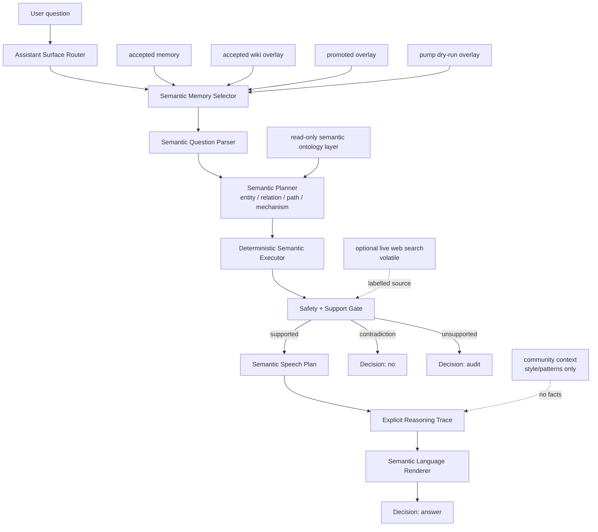
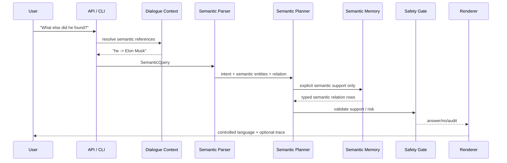

[](https://doi.org/10.5281/zenodo.21323152)
[](LICENSE)

# Microworld

Experimental semantic AI runtime exploring explicit memory, deterministic
reasoning, dialogue systems, and controlled language generation.

## What It Is

Microworld tests a new approach to AI: build the runtime around explicit,
inspectable semantic state instead of asking one opaque next-token model to do
facts, reasoning, dialogue, style, and safety at the same time. The project is
a research implementation of semantic memory, semantic reasoning, semantic
dialogue context, and a separately controlled speech layer.

The same reasoning core that answers factual questions also generates free
text: a poetry/prose layer built by inverting a single accept/reject gate. See
[Creative mode](#creative-mode-the-inverted-gate-as-a-separate-layer) below.

Microworld's factual QA path is a bounded explicit-memory runtime: it answers
only when it can point to controlled semantic memory and says `audit` when
support is missing. Factual support stays separate from reasoning, dialogue,
language style, community patterns, live search, and session context. A clearly
creative request uses a separate labelled generation layer; it is not presented
as factual support.

## Try It Locally

The fastest reproducible path is the self-contained
[standalone runtime](microworld-standalone/README.md). It includes the local
runtime artifacts required by the default demo, so there is no model download,
API key, database, or external service to configure.

```bash
git clone https://github.com/zowelqqee/microworld.git
cd microworld/microworld-standalone
python3 -m venv .venv
source .venv/bin/activate
python3 -m pip install --upgrade pip
python3 -m pip install .
microworld "Who founded SpaceX?" --overlay pump-dry-run
```

To start the local web UI after installation:

```bash
microworld-api --overlay pump-dry-run --port 8000
```

Open <http://127.0.0.1:8000>. For an interactive terminal session, run
`microworld --overlay pump-dry-run --interactive`.

The central abstraction in Microworld is semantics. Graphs may be used as one
storage representation for semantic structures, but the project is not
fundamentally a graph database or graph QA engine. A graph edge is useful
because it encodes a semantic relation; the relation is the important object,
not the storage shape.

## Research Question

```text
Can useful inference, memory growth, dialogue, controlled language generation,
and trust learning be built from explicit semantic entities, typed relations,
mechanism roles, safety policy, and deterministic planners instead of hidden
model weights?
```

The current answer is stronger than a toy answer bot: inside bounded
explicit-memory domains, the runtime can transform language into semantic
structures, answer, audit, reason over gaps, carry dialogue context, render
controlled English, and hold quality under a 1,000-question deterministic
speech benchmark. The important new result is that the answer surface is now
measured separately from factual coverage: speech can be tested, improved, and
stress-tested without pretending that a phrase model is factual memory.

## Key Ideas

- Local-first performance: indexed semantic-memory lookup and small
  deterministic planners keep the supported answer path in milliseconds on the
  measured workload, without GPU inference or per-answer model-API calls.
- On-device by design: the unmodified stdlib-only Python answer path is embedded
  in the native iPhone demo, so the runtime can work offline rather than merely
  forwarding prompts to a server.
- Semantic-first runtime: text is an interface, not the internal reasoning
  substrate.
- Explicit memory: accepted memory, overlays, proposals, snapshots, weak
  context, and dialogue state remain separate artifacts.
- Deterministic reasoning: support checks, relation/path/mechanism decisions,
  contradiction handling, and audit decisions are inspectable.
- Dialogue context: follow-up questions resolve over explicit semantic state,
  not hidden chat history.
- Controlled language generation: facts are selected by semantic support;
  speech is rendered separately.
- Safety by boundary: unsupported, current-sensitive, private, ambiguous, or
  weakly supported claims audit instead of being guessed.

The core behavior is deliberately boring in the best possible way:

```text
supported semantic claim present -> answer
explicit contradiction          -> no
weak/volatile/current gap       -> audit
unknown or unsupported form     -> audit
```

No answer should appear because a model "felt" that it was plausible.

## Latest Performance and Reliability Snapshot

The latest saved measurements are two complementary July 14 local studies: an
open-book QA comparison over the same evidence spans and a persistent SQLite
behavior-graph scaling run. They measure different workloads and should not be
collapsed into one universal score.

| Workload | Measured result | What it establishes |
|---|---|---|
| Open-book direct relation QA | 93% accuracy; 14.3 ms p50 | Supported direct relations are fast and usually recovered. |
| Open-book negative QA | 100% correct audit; 6.3 ms p50 | The factual path declines unsupported requested relations. |
| Open-book paraphrase QA | 42% accuracy; 23.8 ms p50 | Superseded — this July 14 figure predates the predicate-resolution work; held-out paraphrase now measures 100%. See [Paraphrase: held-out confirmed](#paraphrase-held-out-confirmed-after-structural--semantic-fallback-work). |
| Open-book multi-evidence QA | 0% accuracy; 31.9 ms p50 | All 50 cases failed target resolution before the behavior planner. |
| Persistent graph, 1m relations | 2.65 ms p50; 3.11 ms p95 | The tested warm path is dominated by its local frontier, while sidecar/build scale with graph size. |

### Known failure modes

- Multi-evidence QA (0/50): failures occur at `<stage — fill in from trace analysis>` before reaching the executor. Root cause not yet isolated to a single pipeline stage — TODO before next benchmark run.
- ~~Paraphrase QA (42%): current predicate mapping and entity resolution do not generalize beyond direct-relation phrasing.~~ **Resolved on held-out material.** Predicate mapping now generalizes to passives, nominalizations, and verbless forms; held-out paraphrase measures 100% / 100% / 88% across three sets. The 42% row above is a dated committed snapshot of this workload and has not been re-published.

The open-book run used 250 fixed cases and five warmed repeats per case. Its
failure analysis is part of the result: it exposed parser/resolver coverage
limits rather than hiding them behind a single aggregate score. The full
comparison, raw artifacts, persistent-graph curves, and hypothetical resource
references are documented in [docs/benchmarks.md](docs/benchmarks.md).

The older 1,000-question speech benchmark remains a useful reliability result
for the controlled answer surface; it is not a factual-coverage or open-book
benchmark. On that saved workload it recorded 8.05 ms p50 and 29.47 ms p95.

### Earlier controlled speech-reliability snapshot

The iPhone demo embeds CPython and runs the real QA and creative engines with
no server or network. It is verified to run on a physical iPhone 11; device
latency remains intentionally unreported until it is measured separately. See
[the on-device demo](ios_demo/README_IOS.md) and [device benchmark
notes](ios_demo/DEVICE_BENCHMARK.md).

The saved July 9 speech/reasoning snapshot is from
`worldpgt/experiments/benchmarks/speech_quality_large_20260709T111746Z.json`
and
`worldpgt/experiments/benchmarks/speech_quality_stress_20260709T111906Z.json`:

| Metric | Large suite | Stress suite |
|---|---:|---:|
| Questions | 50 | 1,000 |
| Passed | 50 / 50 | 1,000 / 1,000 |
| Quality rate | 100.0% | 100.0% |
| Honest gap rate | 9 / 9 | 171 / 171 |
| Debug-like output | 0 | 0 |
| Repetitive output | 0 | 0 |
| Decision drift | 0 | 0 |
| Missing required text | 0 | 0 |
| Latency p50 | 3.39 ms | 8.05 ms |
| Latency p95 | 26.98 ms | 29.47 ms |
| Latency p99 | 27.73 ms | 38.90 ms |

The stress suite is a deterministic 1,000-question speech benchmark over known
categories, not 1,000 independent open-domain facts. It shows that the local
CPU answer path stays in the millisecond range under this workload without a
GPU or model API. Its purpose is to measure the user-facing
speech/reasoning surface under load: profiles, thin profiles, mechanism gaps,
direct relations, connection paths, adversarial inversions, current/live
requests, private-info requests, unsupported universal claims, and style
control.

### Persistent graph scaling

The persistent behavior graph was measured at 1k, 10k, 100k, and 1m relation
edges. At a fixed local frontier, warm latency stays essentially flat while the
SQLite sidecar and cold build grow with graph size:

The graph also makes the local cost visible: 14, 194, 1,994, and 19,994
considered edges took 0.20, 1.82, 18.08, and 194.14 ms. This is a local-frontier
cost, not a claim that arbitrary high-degree nodes are constant-time.


| Relations | Warm p50 | Warm p95 | SQLite sidecar | Build |
|---:|---:|---:|---:|---:|
| 1k | 2.6428 ms | 3.0516 ms | 0.5898 MiB | 27.40 ms |
| 10k | 2.6079 ms | 2.9091 ms | 5.37 MiB | 148.08 ms |
| 100k | 2.5645 ms | 2.8246 ms | 53.75 MiB | 1.559 s |
| 1m | 2.6457 ms | 3.1088 ms | 544.76 MiB | 20.637 s |


## Matched-scale comparison: explicit-memory runtime vs small local LLM

Both systems use the same device, the same questions, and the same evidence
spans; this is a matched small-scale comparison for their respective resource
classes. MicroWorld receives structured relations built by the pump from that
evidence, while Qwen receives the same raw evidence spans as prompt context.
Both are open-book: neither is evaluated from parametric/internal knowledge
alone.

The original matched-scale comparison used
`mlx-community/Qwen2.5-0.5B-Instruct-4bit`. A later scale-curve experiment ran
the same frozen material and generation protocol with 3B and 7B variants. This
is still a narrow comparison over supplied evidence, not a broad comparison
with frontier language models or open-domain systems.

**Held-out validation (40 questions, unseen subjects/phrasings, not used in any prior fix development):**

| System | Category | Accuracy | Object recall | Unsupported | Provenance | p50 |
|---|---|---:|---:|---:|---:|---:|
| MicroWorld explicit graph runtime | Paraphrase | 100% | 100% | 0% | 100% | 18.4 ms |
| MicroWorld explicit graph runtime | Multi-evidence implicit | 100% | 100% | 0% | 100% | 24.9 ms |
| MicroWorld explicit graph runtime | Multi-evidence explicit | 100% | 100% | 0% | 100% | 42.4 ms |
| Qwen2.5-0.5B-Instruct 4-bit | Paraphrase | 70% | 74.16666666666667% | 0% | — | 297.1071665 ms |
| Qwen2.5-0.5B-Instruct 4-bit | Multi-evidence implicit | 70% | 85% | 0% | — | 503.021979 ms |
| Qwen2.5-0.5B-Instruct 4-bit | Multi-evidence explicit | 60% | 81.66666666666667% | 0% | — | 418.90168700000004 ms |

The paraphrase row previously read 60% against Qwen's 70%. It was raised to 100%
by the predicate-resolution work described under [Paraphrase: held-out
confirmed](#paraphrase-held-out-confirmed-after-structural--semantic-fallback-work);
the Qwen rows are the same saved run and are unchanged.

Provenance is measured only for MicroWorld: the answer plan must reference the
exact expected evidence-edge IDs. Qwen returns free text without edge-level
attribution, so this column is not applicable (—), not zero. The measured
[held-out comparison table](artifacts/open_book_qa/heldout_v2/comparison_table.csv)
and [corpus summary](artifacts/open_book_qa/heldout_v2/dataset_summary.json)
are the primary source of truth.

### Final comparison across the completed research track

The table deliberately keeps dataset-specific and held-out evidence separate.
`Direct` and `Negative` use the 250-case `main_dataset`, which was used during
iterative development; 7B did not complete that run. The remaining rows use
the frozen `heldout_v2` set. Values are answer accuracy copied without favorable
rounding from the committed [scale-curve table](artifacts/open_book_qa/scale_curve_v1/comparison_table.csv)
and [final report](artifacts/open_book_qa/scale_curve_v1/final_report.md).

| Category | MicroWorld | Qwen 0.5B | Qwen 3B | Qwen 7B | Status |
|---|---:|---:|---:|---:|---|
| Direct | 0.98 | 0.65 | 0.68 | — (not completed) | dataset-specific |
| Negative | 1.00 | 0.08 | 0.98 | — (not completed) | dataset-specific |
| Multi-evidence (explicit) | 1.00 | 0.60 | 0.70 | 0.00 | held-out |
| Multi-evidence (implicit) | 1.00 | 0.70 | 0.90 | 0.70 | held-out |
| Paraphrase | 1.00 | 0.70 | 0.50 | 0.15 | held-out, post-fix |

**Key finding: non-monotonic scaling behavior.** Larger Qwen models followed
the strict no-guess instruction more literally. That sharply improved negative
detection, while causing paraphrase and explicit multi-evidence accuracy to
collapse on passive-voice reformulations whose predicates differed from the
surface wording in the evidence. Implicit multi-evidence peaked at 3B and then
declined at 7B. This is an observed interaction among model scale, the strict
abstention prompt, and these frozen datasets—not a general claim that larger
models are less capable.

MicroWorld's negative detection ceiling (1.00) was already reached before this
comparison began — apparent gap closure with Qwen at scale reflects Qwen
approaching that ceiling, not architectural convergence.

### Dataset-specific results (not held-out — see caveat)

These numbers come from the same dataset used during iterative fixing of the
resolver and predicate-constrained planner. Where a held-out figure exists
above, treat the held-out number as the valid generalization estimate. This
caveat originally rested on paraphrase, which dropped from 92% (dataset-specific)
to 60% (held-out) — evidence that the higher figure partly reflected fitting to
known template patterns. That specific gap has since been closed on held-out
material (see below); the general principle stands, and Direct and Negative have
still not been re-verified held-out. Treat those two figures as provisional
pending the same validation.

| Category | MicroWorld accuracy |
|---|---:|
| Direct | 91.18% |
| Negative | 100% |
| Paraphrase | 92% |
| Multi-evidence | 100% |

### Paraphrase: held-out confirmed after structural + semantic-fallback work

Held-out paraphrase was previously 60% for MicroWorld versus 70% for Qwen — a
measured disadvantage at matched scale, caused by predicate mapping tuned to
known template patterns that did not generalize to novel grammatical forms
(passives, nominalizations).

That gap was closed through a combination of **structural predicate-pattern
refinement** and a small, targeted **semantic-similarity fallback** (GloVe-based
static embeddings, no runtime neural inference — the architecture is unchanged).
An ablation study showed the structural fixes accounted for most of the
improvement, with the similarity fallback contributing a smaller, margin-gated
gain on a minority of cases.

| Paraphrase set | A: before | B: +structural | C: shipped | Qwen |
|---|---:|---:|---:|---:|
| heldout_v2 (100 cases) | 50% | 100% | **100%** | 70% |
| heldout_v3 (100 cases) | 75% | 90% | **100%** | 80% |
| independent_v1 (80 cases) | 81% | 88% | **88%** | 69% |

The similarity fallback (column B → C) changes the parse of 4 of 56 unique
paraphrase questions and is decisive for 2; its marginal contribution is +10
points on heldout_v3 and zero on the other two sets. The rest came from three
structural shapes that locate the *subject span* in grammatical forms the
canonical regexes never covered (`By whom was X engineered?`), and from letting
a shape discard an exact keyword hit that is grammatically impossible for it —
verb lemmatization erases voice ("engineered" → "engineer" → the *active*
relation `develops`), which previously answered passives in the wrong direction.

Column A is the working tree at the start of that session, which already carried
unrelated uncommitted work; the published committed baseline for heldout_v2 was
60% / 10% unsupported. Both describe "before this change" at different code
states. Full ablation, raw runs, and the honest attribution breakdown:
[semantic_predicate_fallback_v1/final_report.md](artifacts/open_book_qa/semantic_predicate_fallback_v1/final_report.md).

**Threshold discipline.** Mean-pooled GloVe vectors of short questions sit in a
tight cone: absolute cosine ranges 0.79–0.98 for *both* true and false
candidates, so absolute similarity alone is weakly discriminative. The decision
gate is therefore **0.85 absolute cosine plus a 0.04 margin** over the runner-up
predicate, not absolute cosine alone; when the two embedding views disagree, the
parser abstains. This is the same "never guess" discipline the audit gate applies
elsewhere in the architecture, extended to the embedding layer: a false negative
costs one audit, a false positive would silently answer the wrong relation.

The previously reported 10% unsupported-answer rate on held-out paraphrase is
resolved: heldout_v2 and heldout_v3 now measure 0% and 5%. Guardrails held —
the main 250-case dataset is unchanged in every metric (negative accuracy 100%
across 50 cases), and the independent set declines all 20 negative cases where
Qwen answers all 20.

**Fan-out follow-up:** the targeted intent-cue fix reduced independent_v1's
unsupported rate from 25% to 6.25% while holding answer accuracy at 87.5%; all
other measured sets stayed unchanged. The remaining flagged case asks for a
many-valued `used_for` relation while the dataset expects only one of two valid
objects. It is a same-predicate expected-set mismatch, not foreign-predicate
fan-out. See the [fan-out closing report](artifacts/open_book_qa/renderer_fanout_fix_v1/final_report.md).

### Multi-evidence: held-out confirmed

MicroWorld reached 100% on both implicit and explicit multi-evidence phrasing
for held-out subjects not seen during resolver or planner development. This
includes implicit multi-evidence questions that do not name the required
relation types directly, the harder version of the task. The methodology and
the initial relation-density limitation that made this held-out split infeasible
before the source-specific extraction audit are documented in the [held-out relation-density
audit](artifacts/open_book_qa/heldout_v1/README.md) and the final [held-out v2
corpus summary](artifacts/open_book_qa/heldout_v2/dataset_summary.json).

### Source-specific extraction finding: source coverage is not relation density

A proposal-only re-parse of the 85 unique arXiv quarantine relations found 28
explicit source-supported candidates; 25 passed the unchanged precision gates.
All 25 repeated a predicate group already present for their subject, so none of
the 331 audited subjects gained a second independent predicate group. This
falsifies the working hypothesis that the arXiv quarantine mainly contained
missing second facts: in this slice it carried repeated support for existing
fact types instead.

The bounded Crossref audit showed the same pattern: 13 candidates passed the
precision gates from 59 unique quarantined relations, and all 13 duplicated an
existing predicate group. OpenAlex was smaller (7 unique relations): none
survived the bounded-endpoint guard, and none had a potentially new predicate
group. All three experiments were proposal-only—no accepted, promoted, or
serving memory changed. See the [arXiv full
report](artifacts/open_book_qa/extractors/arxiv_full_run_report.json), [Crossref
full report](artifacts/open_book_qa/extractors/crossref_full_run_report.json),
and [OpenAlex full report](artifacts/open_book_qa/extractors/openalex_full_run_report.json).

At matched scale, MicroWorld's explicit-memory-with-an-audit-gate approach
shows a validated, held-out-confirmed advantage on multi-evidence composition
and, after the predicate-resolution work above, on paraphrase as well; plus an
unvalidated but large apparent advantage on direct lookup and negative detection
pending held-out confirmation.

**Category progression** (held-out unless marked dataset-specific):

- **paraphrase:** 42% (early, dataset-specific) → 60% / 75% (held-out v2 / v3
  rounds) → **100% / 100% / 88%** (held-out v2 / v3 / independent_v1, after
  structural + semantic-fallback work) vs Qwen 70% / 80% / 69%.
- **multi-evidence:** 0% (early, dataset-specific) → **100% / 100%** (held-out
  implicit / explicit) vs Qwen 70% / 60%.

The paraphrase progression is the one category where a held-out disadvantage
against a generative model at matched scale was measured, published, and then
closed. Its final step is attributed as above: mostly structural pattern work,
with a smaller margin-gated similarity fallback — not a semantic-embedding
result on its own.

## High-Level Architecture

At the top level, the runtime is no longer just an answer surface:

```text
Text -> Semantic Structures -> Semantic Reasoning -> Semantic Dialogue Context
     -> Semantic Language Renderer -> Answer
```

Semantic memory, reasoning, dialogue, and speech stay separate so each layer
can be measured, audited, and improved without silently changing the others.
Storage may be tabular JSON, overlay rows, indexes, or graph-shaped structures;
the runtime contract is semantic, not storage-specific.

When reasoning is enabled, a resolved target may also enter the optional
answer-behavior layer: an experimental `overlay_relation` evidence graph is
opened through a persistent SQLite index, a local frontier is scored into an
inspectable `AnswerPlan`, and the renderer expands the answer only when the
plan has enough independently supported blocks. This layer cannot replace an
audit with an unsupported claim and remains separate from accepted memory.



| Layer | Code |
|---|---|
| Assistant surface | `worldpgt/assistant_surface/` |
| Web/API UI | `worldpgt/api/` |
| Semantic dialogue context | `worldpgt/dialogue/` |
| Semantic reasoning and speech planning | `worldpgt/cognition/`, `worldpgt/entity_qa/semantic_speech_planner.py` |
| Evidence-backed answer behavior | `worldpgt/reasoning/answer_behavior.py`, `worldpgt/reasoning/answer_plan_renderer.py` |
| Creative free-generation (separate inverted-gate layer) | `worldpgt/cognition/creative_generator.py` |
| Community speech/cognitive patterns | `worldpgt/community_context/` |
| Optional live search | `worldpgt/web_search/` |
| Semantic entity inference | `worldpgt/entity_qa/` |
| Semantic query primitives | `worldpgt/query_engine/` |
| Multi-hop semantic reasoning | `worldpgt/multihop_qa/` |
| Relation extraction | `worldpgt/relation_extraction_v2/` |
| Knowledge pump | `worldpgt/knowledge_pump/` |
| Safety and temporal policy | `worldpgt/knowledge/`, `worldpgt/relation_extraction_v2/relation_policy.py` |

See [docs/architecture.md](docs/architecture.md) and
[docs/semantic_runtime.md](docs/semantic_runtime.md) for the detailed
engineering model.

## Runtime Flow



The parser currently recognizes relation lookup, inverse lookup, comparative
questions, `is_a` traversal, count, filtered lookup, path/connection questions,
and open synthesis. A clear creative ask instead routes to a separate
free-generation layer (see [Creative mode](#creative-mode-the-inverted-gate-as-a-separate-layer)).

## Dialogue Example

Dialogue context is explicit semantic state, not model memory and not a hidden
chat log. It may select which existing entity a later question refers to, but
it may not create a fact about that entity.

```text
Q1: Tell me about SpaceX.
A1: SpaceX is an aerospace manufacturer and space transportation company.

Q2: Who founded it?
Resolution:
  slot "it" -> SpaceX
  strategy: salience
A2: SpaceX was founded by Elon Musk.

Q3: Tell me about Elon Musk.
A3: Elon Musk is a businessman and entrepreneur.

Q4: What else did he found?
Resolution:
  slot "he" -> Elon Musk
  exclusion: already surfaced SpaceX for founded_by
A4: Elon Musk founded Tesla, Neuralink, The Boring Company, xAI, Zip2, and Big Green.
```

Ambiguity produces an audit rather than a best guess. The detailed state model,
resolver rules, benchmark behavior, and migration path are documented in
[docs/dialogue_context.md](docs/dialogue_context.md).

## Benchmark Example

`benchmark_speech_quality_v1.py` measures the answer surface, not factual
coverage. It treats the semantic planner as an explicit-memory lookup and
checks whether speech stays natural, honest about gaps, non-repetitive, and
free of debug/internal wording.

```bash
python3 -m worldpgt.experiments.benchmark_speech_quality_v1 --suite stress
```

Deterministic speech-renderer benchmark snapshot:

| Metric | Value |
|---|---:|
| questions | 1,000 |
| passed | 1,000 / 1,000 |
| quality_rate | 100.0% |
| honest_gap_rate | 171 / 171 |
| mean latency | 14.71 ms |
| p50 latency | 8.05 ms |
| p95 latency | 29.47 ms |
| p99 latency | 38.90 ms |
| max latency | 123.53 ms |
| debug-like output | 0 |
| repetitive output | 0 |
| decision drift | 0 |

Treat this as a workload-specific runtime result, not a universal benchmark.

## Architecture Transfer Experiment (`poetry_lab/`)

A separate research probe tested whether the runtime's core is *source-agnostic*:
keep the mechanisms (typed concept graph + spreading activation for reasoning, a
learned frequency phrase graph traversed by a seeded deterministic pick for
language, JSON artifacts as the layer boundary, a gate between reasoning and
output) and swap **only** the ingested knowledge — from wiki/Reddit facts to a
Russian poetry and prose corpus. The same machine then produces verse and
narrative prose instead of QA answers.

The value is not the poems; it is that every improvement had to be a *named
production mechanism ported by shape*, which makes the architecture's
load-bearing parts explicit. Measured on the batteries in `poetry_lab/eval/`:

| Mechanism ported from production | Metric it moved | Before → After |
|---|---|---:|
| Multi-word fragment context (order-1 → order-2 phrase model) | local grammaticality (real 3-word spans) | 0.19 → 0.79 |
| Explicit discourse state + salience ranking | inter-line continuity | 0.13 → 0.23 |
| Speech-plan subject/predicate commitment | lines asserting a subject + action | 0.45 → 0.79 |
| Intent-seeded generation (`must_include` walk hook) | planned-concept realization | 0.02 → 0.11 |

Two findings held across the whole experiment and are the reusable ones:

- **Reasoning and language scale in opposite directions.** More corpus keeps
  improving the reasoning-layer metric (thematic coherence 0.25 → 0.67 across a
  120× corpus scale-up, 371 → 43,973 lines) while gradually degrading the
  language layer's hard constraints (meter within ±1 syllable 89% → 78%). Both
  trace to one cause: a bigger, flatter frequency table helps spreading
  activation without limit but gives a target-chasing traversal more
  low-frequency detours.
- **The accept/reject gate is domain-defining, not source-defined.** The
  architecture transferred only after *inverting* the support gate — QA allows
  output when every claim is grounded; verse allows output only when it does
  **not** reproduce a corpus 4-gram (recombine, not recite). Same slot, opposite
  polarity.

### Reverse transfer: a mechanism fed back into production

The transfer later ran both ways. Description mode ("Опиши комнату") was
producing one stunted fact per sentence; the fix was a three-layer **fact
bundle** — description relations tagged with grammatical roles by morphology
(not a word list), a reasoning step that bundles a primary fact with a
compatible modifier and prepositional link about the *same* subject, and a
speech step that only positions them. That mechanism was missing in production
QA, so it was ported *into* `worldpgt/`:

- **Fusion decided by learned surface, not a hardcoded list.** Whether two
  adjacent facts coordinate into one sentence is now read off the grammatical
  frame of each fact's *learned phrase fragment* (`develops X` → active,
  `was founded by X` → past-passive, `is owned by X` → copular), so a new
  relation type fuses correctly with no code edit (`cognition/phrase_graph.py`).
- **Subject-locative bundle.** The reasoning layer folds a locative relation
  into the subject noun phrase ("a robotics company headquartered in Boston")
  instead of a separate choppy sentence, with the participial surface derived
  from the learned fragment (`entity_qa/synthesis_engine.py`,
  `relation_extraction_v2/types.py`).

Both are test-covered and dormant on the current overlay (no locative relations
extracted yet), so every existing answer renders unchanged until the facts to
feed them arrive — the same shape as the lab, where the bundling was built
before the facts to fill it.

### Creative mode: the inverted gate, as a separate layer

The single most reusable lab finding — *the accept/reject gate is
domain-defining* — is now a production feature. **Creative mode** is a second,
explicitly separated layer beside factual QA, and it runs the exact inverted
gate the lab isolated:

```text
factual layer   : answer only if every claim is grounded in memory, else audit.
creative layer  : generate freely, allow output only if it does NOT recite a
                  corpus 4-gram (recombine, never recite).
```

The separation is enforced at the router: a clear creative ask ("write a story
about…", "imagine…", "compose a poem about…") routes to `creative_request` and a
token-level generator ported from the lab (`cognition/creative_generator.py` —
order-2 word-transition tables trained on the same local prose, seeded
deterministic traversal, 4-gram novelty gate). A factual ask ("Tell me about
SpaceX", "Describe SpaceX") is untouched and stays on the strict path.

Safety is preserved by ordering, not by weakening: every hard-safety screen
(private, current-sensitive, universal, inversion) runs **before** creative
routing, so "write a story about *X*'s home address" still audits. Creative
output is never presented as fact — it carries `support_kind=creative_generated`,
`supported_by_context=False`, and an explicit `[Creative mode — generated … not
verified fact]` label.

Full method, per-mechanism A/Bs, honest failure cases, and the scaling analysis
are in [`poetry_lab/README.md`](poetry_lab/README.md).

## Repository Layout

```text
worldpgt/
  api/                    FastAPI server and static UI
  assistant_surface/      orchestrator, router, context selector, styles
  cognition/              reasoning traces, thought loop, semantic moves, phrase storage
  community_context/      Reddit/HN-style context and semantic pattern memory
  dialogue/               semantic dialogue state and reference resolution
  entity_qa/              semantic parser, analyzer, planner, renderer, synthesis
  web_search/             optional volatile live-search providers and cache
  query_engine/           semantic Find, Filter, Count, Compare, Traverse, Classify
  multihop_qa/            explicit semantic relation-chain reasoning
  cross_page_qa/          controlled cross-page connection QA
  relation_extraction_v2/ relation policy, patterns, validators
  knowledge_pump/         extraction yield, precision gates, frontier logic
  knowledge/              entity types, staleness, ontology helpers
  pump_fact_qa/           generated fact-QA checks for pump outputs
  experiments/            runners, artifacts, overlays, reports
  docs/                   implementation audit, safety model, overlay notes
docs/                     project-level engineering documentation
poetry_lab/               architecture-transfer experiment (verse/prose over the same core)
ios_demo/                 native SwiftUI app running QA + Creative on-device, fully offline
```

### On-device demo (`ios_demo/`)

A native iOS app embeds CPython and runs the **real** engine on an iPhone with
no server, API, or network — QA from `worldpgt`, and Creative from
`poetry_lab`'s three-layer narrative generator over an English literary corpus.
The answer path is stdlib-only pure Python, so the unmodified package runs
unchanged in the embedded interpreter. See
[`ios_demo/README_IOS.md`](ios_demo/README_IOS.md),
[`ios_demo/TECHNICAL_DECISION.md`](ios_demo/TECHNICAL_DECISION.md), and
[`ios_demo/DEVICE_BENCHMARK.md`](ios_demo/DEVICE_BENCHMARK.md).

## Quick Start

CLI:

```bash
python3 worldpgt/experiments/ask_microworld_v1.py \
  --overlay pump-dry-run \
  --enable-multihop \
  "Who founded SpaceX?"
```

Interactive session with dialogue context:

```bash
python3 worldpgt/experiments/ask_microworld_v1.py \
  --overlay pump-dry-run \
  --enable-multihop \
  --interactive
```

Web UI / API:

```bash
python3 -m worldpgt.api.server --overlay pump-dry-run --port 8000
# open http://localhost:8000
```

Focused speech/reasoning benchmark:

```bash
python3 -m worldpgt.experiments.benchmark_speech_quality_v1 --suite stress
```

The expanded runner list and validation notes are in
[docs/benchmarks.md](docs/benchmarks.md) and
[docs/knowledge_pump.md](docs/knowledge_pump.md).

## Documentation

| Document | Description |
|---|---|
| [architecture.md](docs/architecture.md) | Module boundaries, memory buckets, community context, optional live search, and runtime artifacts. |
| [semantic_runtime.md](docs/semantic_runtime.md) | Semantic-first design, planning, question types, examples, and support contracts. |
| [dialogue_context.md](docs/dialogue_context.md) | Explicit session state, resolver behavior, ambiguity handling, and dialogue-v2 migration. |
| [language_renderer.md](docs/language_renderer.md) | Controlled text generation, phrase graph behavior, styles, and surface validation. |
| [knowledge_pump.md](docs/knowledge_pump.md) | Proposal-only acquisition, precision gates, frontier loops, and pump status. |
| [safety_model.md](docs/safety_model.md) | Support policy, temporal policy, memory boundaries, live-search disclosure, and known safety limits. |
| [benchmarks.md](docs/benchmarks.md) | Current benchmark snapshots, performance, WebQuestions-style results, validation commands, and artifact paths. |
| [research_results.md](docs/research_results.md) | Preserved historical tracks, demonstrated results, limitations, next work, and project status. |
| [poetry_lab/README.md](poetry_lab/README.md) | Source-agnostic architecture-transfer experiment: verse/prose over the same core, per-mechanism A/Bs, scaling analysis, and the reverse transfer back into production QA. |

## Status

Experimental and local. The active path is a bounded semantic-memory runtime
with deterministic planning, explicit support checks, dialogue state, and
controlled rendering. It is useful where the current artifacts contain support;
outside that boundary it should audit or label volatile sources. The research
target is inspectability of memory, trust, policy, dialogue, and rendering, not
open-ended language-model generality.

## Citation

BibTeX metadata is available in [`CITATION.bib`](CITATION.bib).

## License

Apache License 2.0. See the LICENSE file for details.
