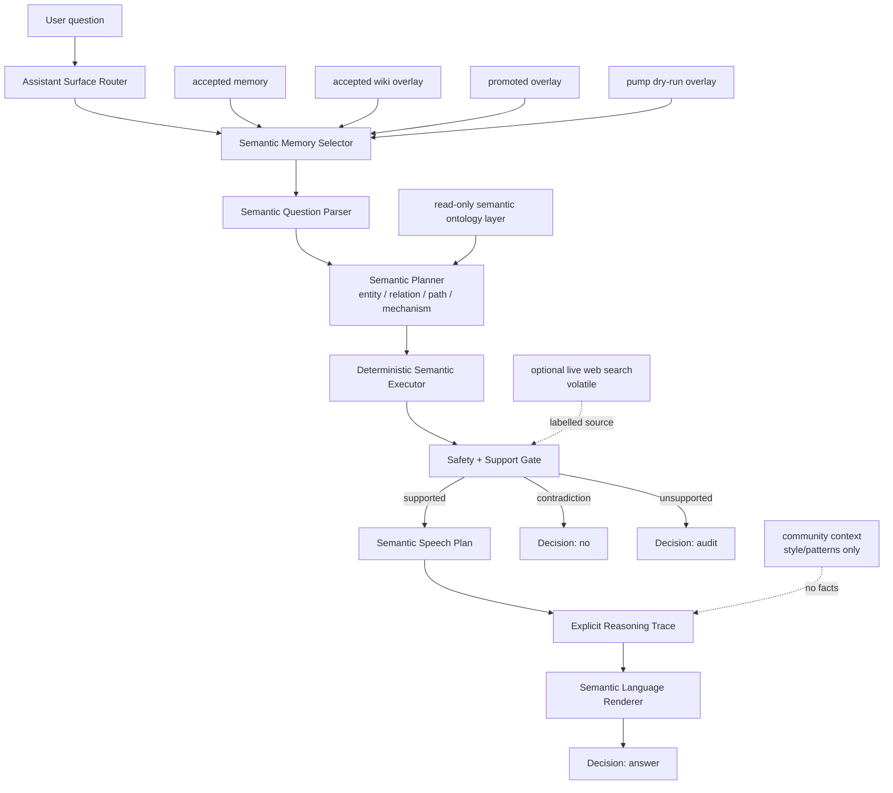
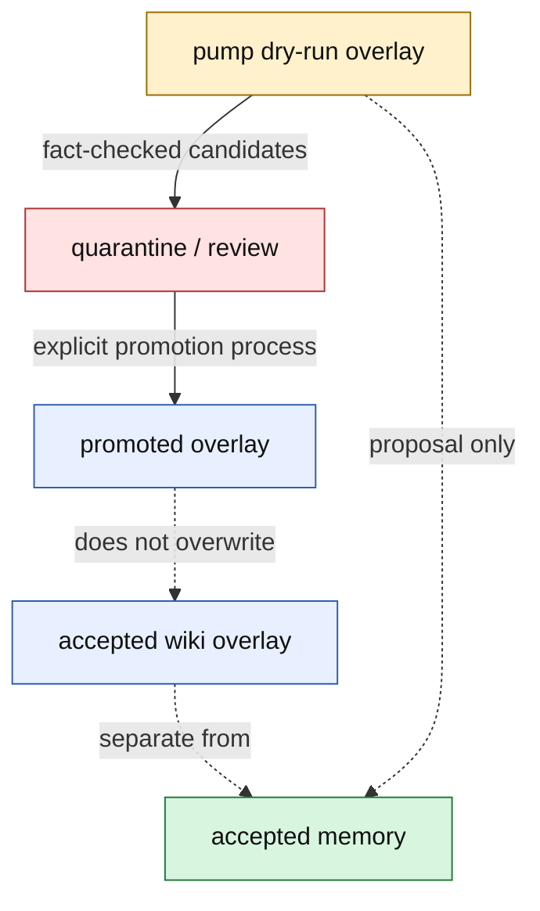

# Architecture

This document describes Microworld as an experimental semantic AI runtime. It
focuses on the engineering boundaries that keep memory, reasoning, dialogue,
speech, community patterns, live search, and safety policy inspectable as
separate layers.

Microworld is not fundamentally a graph database or graph QA engine. Graphs may
be used as one representation for semantic structures, but the runtime contract
is semantic: entities, definitions, typed relations, mechanism roles,
source-qualified claims, support policy, and deterministic plans.

## Runtime Contract

At the top level, the runtime is no longer just an answer surface:

```text
Text -> Semantic Structures -> Semantic Reasoning -> Semantic Dialogue Context
     -> Semantic Language Renderer -> Answer
```

Semantic memory, reasoning, dialogue, and speech stay separate so each layer
can be measured, audited, and improved without silently changing the others.
Storage may be tabular JSON, overlay rows, indexes, or graph-shaped structures;
the runtime contract is semantic, not storage-specific.



## Main Modules

| Layer | Code |
|---|---|
| Assistant surface | `worldpgt/assistant_surface/` |
| Web/API UI | `worldpgt/api/` |
| Semantic dialogue context | `worldpgt/dialogue/` |
| Semantic reasoning and speech planning | `worldpgt/cognition/`, `worldpgt/entity_qa/semantic_speech_planner.py` |
| Community speech/cognitive patterns | `worldpgt/community_context/` |
| Optional live search | `worldpgt/web_search/` |
| Semantic entity inference | `worldpgt/entity_qa/` |
| Semantic query primitives | `worldpgt/query_engine/` |
| Multi-hop semantic reasoning | `worldpgt/multihop_qa/` |
| Relation extraction | `worldpgt/relation_extraction_v2/` |
| Knowledge pump | `worldpgt/knowledge_pump/` |
| Pump artifacts | `worldpgt/experiments/knowledge_pump_v1/` |
| Safety and temporal policy | `worldpgt/knowledge/`, `worldpgt/relation_extraction_v2/relation_policy.py` |

## Memory Boundaries

This boundary is the heart of the project. Proposal artifacts are useful, but
they are not silently promoted into trusted semantic memory.

| Bucket | Artifact | Meaning |
|---|---|---|
| Accepted memory | `worldpgt/experiments/accepted_knowledge_memory_v1.json` | Trusted explicit semantic memory. |
| Accepted wiki overlay | `worldpgt/experiments/accepted_wiki_memory_overlay_v1.json` | Isolated wiki semantic-memory overlay. |
| Promoted overlay | `worldpgt/experiments/self_ingestion_v1/promotion/promoted_wiki_memory_overlay_v1.json` | Separate promoted artifact, not accepted memory. |
| Pump dry-run overlay | `worldpgt/experiments/knowledge_pump_v1/pump_dry_run_overlay.json` | Proposal overlay for runtime experiments. |
| Weak context | weak links inside overlays | Contextual association only, never a stable fact. |
| Ontology layer | `wikidata_p279_ontology_layer.json` | Read-only `is_a` traversal support. |



## Community Context Layer

Microworld has a low-trust community layer built from local Reddit/Hacker
News-like records. This layer is deliberately not factual memory. It is for
speech habits, common questions, examples, and reusable cognitive patterns.

```text
local Reddit/HN-like records
  -> classifier / quarantine
  -> reddit_community_context.json
  -> reddit_speaking_profile.json
  -> cognitive_pattern_events.json
  -> cognitive_pattern_graphs.json  # storage artifact for semantic patterns
```

Current artifact snapshot:

```text
input_records_count:             371
accepted_context_items_count:    371
cognitive_pattern_events_count:  428
factual_support_allowed:         false
accepted_overlay_modified:       false
promoted_overlay_modified:       false
snapshot_dry_run_overlay_modified: false
```

The key safety rule is simple:

```text
community context may shape how an answer is explained
community context may not make a factual claim true
```

That is the same separation as the speech benchmark: learn how people ask,
explain, debug, compare, and handle uncertainty, but keep factual support in
accepted memory, overlays, source-qualified snapshots, or live-search results
that are explicitly labelled as volatile.

## Optional Live Search

Microworld also has an optional live-search path for questions that ask for
current or missing information. It is intentionally separate from memory.

```text
current/live question
  -> safety route
  -> optional web search provider
  -> answer extraction / relevance filter
  -> rendered with "live web search, volatile" disclosure
  -> never promoted into accepted memory
```

The default composite provider races Wikipedia, Wikidata, and optional Claude
web search under one deadline. It uses query-intent filtering, source
relevance, temporal checks, and a TTL live cache so repeated entity questions
can reuse retrieved text without treating it as trusted memory.

This path is useful, but it is not the same achievement as the controlled
speech/reasoning layer. The latest saved WebQuestions-style open benchmark is
still weak and intentionally documented as experimental:

```text
external_20260706T203034Z.json
total_questions: 250
answer_rate:     42.0%
audit_rate:      58.0%
precision:       28.57% among answered rows
elapsed:         1878.23s
```

So the honest status is: live search exists, is safer than a generic fallback,
and is improving, but it is not yet a strong open-domain inference result.

## Current Artifacts

Core status files:

```text
worldpgt/experiments/benchmark_speech_quality_v1.py
worldpgt/experiments/benchmarks/speech_quality_large_20260709T111746Z.json
worldpgt/experiments/benchmarks/speech_quality_stress_20260709T111906Z.json
worldpgt/experiments/community_context_v1/reddit_community_summary.json
worldpgt/experiments/community_context_v1/reddit_community_context.json
worldpgt/experiments/community_context_v1/reddit_speaking_profile.json
worldpgt/experiments/community_context_v1/cognitive_pattern_events.json
worldpgt/experiments/community_context_v1/cognitive_pattern_graphs.json
worldpgt/experiments/benchmarks/external_20260706T203034Z.json
worldpgt/experiments/knowledge_pump_v1/pump_summary.json
worldpgt/experiments/knowledge_pump_v1/pump_fact_qa_v1/pump_fact_qa_summary.json
worldpgt/experiments/knowledge_pump_v1/assistant/assistant_surface_summary.json
worldpgt/experiments/knowledge_pump_v1/extraction_yield_v2/extraction_yield_v2_summary.json
worldpgt/experiments/knowledge_pump_v1/promotion_readiness_audit_v1/promotion_readiness_summary.json
worldpgt/benchmarks/dialogue_benchmark.py
worldpgt/benchmarks/fixtures/dialogue_sessions_v1.json
```

This trimmed runtime copy does not currently include `worldpgt/docs/`.

Important note: `pump_summary.json` can preserve stale QA fields after a pump
run. When reporting QA precision or prompt counts, prefer the dedicated
`pump_fact_qa_v1/pump_fact_qa_summary.json` artifact unless the summary says QA
is current.

## Repository Layout

```text
worldpgt/
  api/                    FastAPI server and static UI
  assistant_surface/      orchestrator, router, context selector, styles
  cognition/              reasoning traces, thought loop, semantic moves, phrase storage
  community_context/      Reddit/HN-style context and semantic pattern memory
  dialogue/               semantic dialogue state and reference resolution
  entity_qa/              semantic parser, analyzer, planner, renderer, synthesis
  web_search/             optional volatile live-search providers and cache
  query_engine/           semantic Find, Filter, Count, Compare, Traverse, Classify
  multihop_qa/            explicit semantic relation-chain reasoning
  cross_page_qa/          controlled cross-page connection QA
  relation_extraction_v2/ relation policy, patterns, validators
  knowledge_pump/         extraction yield, precision gates, frontier logic
  knowledge/              entity types, staleness, ontology helpers
  pump_fact_qa/           generated fact-QA checks for pump outputs
  experiments/            runners, artifacts, overlays, reports
  docs/                   implementation audit, safety model, overlay notes
```

## Conclusion

Microworld's architecture is designed around explicit semantic state and hard
artifact boundaries. The point is not to hide complexity behind a graph or a
language model; it is to keep memory, evidence, reasoning, dialogue, and speech
separable enough to audit and improve independently.
