# Knowledge Pump

This document describes the Knowledge Pump: Microworld's proposal-only learning
loop. It is responsible for finding candidate semantic claims, testing them, and
writing proposal overlays without silently changing trusted memory.

## Purpose

The Knowledge Pump fetches or reads candidate pages, extracts semantic claims,
filters them through precision gates, tests them through fact checks, and writes
proposal overlays. It does not mutate trusted accepted memory.

```mermaid
flowchart LR
    W["Wikipedia / local snapshots"] --> N["Normalized docs"]
    N --> X["semantic claim extraction<br/>regex + optional spaCy"]
    X --> F["Precision firewall<br/>reject / quarantine / accept"]
    F --> FC["Fact checks<br/>0 wrong answers required"]
    FC --> O["Proposal overlay<br/>pump-dry-run"]
    O --> PR["Promotion readiness audit"]
    PR -->|human / policy gate| PM["promoted overlay"]
    PM -. separate artifact .-> A["accepted memory unchanged"]
```



The pump's role is acquisition and evaluation. It may produce a proposal that a
runtime can test, but promotion remains an explicit artifact and review step.

## Feedback Loops

The pump has three feedback loops:

| Loop | What happens |
|---|---|
| Yield-ranked frontier | Previous batches teach the fetcher which titles are likely to produce answerable semantic claims. |
| Dynamic frontier | Newly fetched pages expose internal Wikipedia links; the frontier grows organically. |
| Audit -> gap -> frontier | `Decision: audit` rows become structured gap signals for future acquisition. |

Recent pump state:

```text
batches_completed:                   275
frontier_titles_total:               361233
dynamic_frontier_file_total:         360685
fetched_count_total:                 22620
fetch_success_count_total:           7120
extraction_yield_v2_candidate_count: 4496
pump_answerable_fact_delta_count:    2836
pump_smoke_wrong_count:              0
```

## Current Pump Snapshot

Current local pump snapshot, from
`worldpgt/experiments/knowledge_pump_v1/pump_summary.json` and named artifact
files unless noted:

| Area | Snapshot |
|---|---:|
| Current dry-run overlay file | 8,930 items |
| Pump dry-run overlay, current filtered count | 6,682 items |
| Pump dry-run overlay, with weak links | 27,808 items |
| Pump world-model delta | 6,455 items |
| Pump answerable fact delta | 2,836 facts |
| Pump relation delta | 1,637 relations |
| Pump definition delta | 1,199 definitions |
| Pump entity delta | 3,619 entity cards / 5,073 raw entity-delta rows |
| Pump batches completed | 275 |
| Total fetched pages | 22,620 |
| Fetch successes | 7,120 |
| Frontier titles total | 361,233 titles |
| Dynamic frontier file | 360,685 titles |
| Assistant smoke | 1,325 supported fact answers / 1,360 prompts / 0 wrong |
| Pump fact QA | 1,200 prompts / 0 wrong / 0 unsupported answers; QA artifact covers 570 facts while pump summary expects 2,836 |
| Extraction v2 | 4,496 candidates / 4,438 safe deltas |
| Promoted wiki overlay | 363 items in the current file; previous baseline was 310 |
| Promotion state | promotion-readiness audit passes; proposal-only; trusted memory unchanged |

Important note: `pump_summary.json` can preserve stale QA fields after a pump
run. When reporting QA precision or prompt counts, prefer the dedicated
`pump_fact_qa_v1/pump_fact_qa_summary.json` artifact unless the summary says QA
is current.

## Current Artifacts

```text
worldpgt/experiments/knowledge_pump_v1/pump_summary.json
worldpgt/experiments/knowledge_pump_v1/pump_fact_qa_v1/pump_fact_qa_summary.json
worldpgt/experiments/knowledge_pump_v1/assistant/assistant_surface_summary.json
worldpgt/experiments/knowledge_pump_v1/extraction_yield_v2/extraction_yield_v2_summary.json
worldpgt/experiments/knowledge_pump_v1/promotion_readiness_audit_v1/promotion_readiness_summary.json
```

## Commands

Knowledge pump batch:

```bash
python3 worldpgt/experiments/run_knowledge_pump_v1.py \
  --enable-spacy \
  --allow-network \
  --frontier-policy yield-ranked
```

Gap-driven audit runner:

```bash
python3 worldpgt/experiments/run_audit_driven_pump_v1.py \
  --period-days 1
```

Focused extraction-yield validation:

```bash
python3 -m pytest worldpgt/tests/test_knowledge_pump_extraction_yield_v2.py -q
```

Recent focused validation:

```text
98 passed   # knowledge_pump_extraction_yield_v2
```

## Limits And Next Work

Current limits from the local artifacts:

- Extraction recall is limited by deterministic patterns, optional spaCy, and
  the current frontier. The pump currently exposes a 2,836-item answerable-fact
  delta, while the dedicated pump fact QA artifact still covers 570 facts.
- Re-extracting existing Wikipedia snapshots fixed duplicate detection against
  the existing overlay via `_drop_duplicates_of_existing_overlay`, but it does
  not add extraction support for founding dates or mission goals phrased like
  "founded in 2002 with the goal of ...".
- Re-extraction plus manual cleanup promoted clean additional rows into
  `promoted_wiki_memory_overlay_v1.json`; the current file contains 363 items
  and the pre-reextract backup remains beside it as
  `promoted_wiki_memory_overlay_v1.json.backup_before_reextract`.
- Pump dry-run overlays and weak-context outputs are proposal or experimental
  artifacts. Promotion readiness can pass, but promotion remains an explicit
  artifact and review step; accepted memory is not silently mutated.

Highest-leverage next steps for the pump:

1. Add concrete Starlink-like mechanism evidence roles (`uses`, `works_by`,
   `used_for`) and verify that questions such as `How does Starlink work?` move
   from answer-with-gap to mechanism answer only when supported.
2. Refresh pump fact QA so it covers the current 2,836-item answerable-fact
   delta instead of the older 570-fact QA artifact.
3. Tighten extraction precision around noisy explanatory predicates before
   widening mechanism/purpose extraction further.
4. Keep promotion explicit: proposal -> fact checks -> review -> promoted
   artifact; never silent accepted-memory mutation.

## Conclusion

The Knowledge Pump is the acquisition side of Microworld, not a hidden
self-modifying memory path. Its value depends on keeping proposals, fact checks,
promotion readiness, promoted artifacts, and accepted memory visibly separate.
