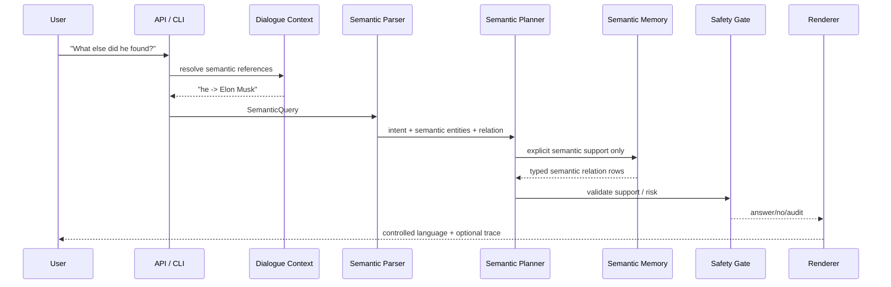

# Semantic Runtime

This document explains the runtime path from user text to semantic query,
deterministic support checks, and controlled answers. It is the engineering
view of Microworld's semantic-first philosophy.

## What It Is

Microworld stores knowledge as semantic entities, definitions, typed semantic
relations, mechanism/purpose roles, source-qualified snapshots, weak context
links, and policy metadata. A user request is parsed into semantic structure,
planned, executed against the relevant memory layer, routed through
safety/support policy, shaped by semantic dialogue context, rendered, and
validated.

The core behavior is:

```text
supported semantic claim present -> answer
explicit contradiction          -> no
weak/volatile/current gap       -> audit
unknown or unsupported form     -> audit
```

No answer should appear because a model "felt" that it was plausible.

## What It Is Not

- Not a general language model.
- Not an open-domain search engine.
- Not live-current fact answering.
- Not a claim that symbolic systems are generally superior to neural systems.
- Not a trusted-memory auto-promotion pipeline.
- Not a production knowledge graph.
- Not fundamentally a graph database or graph QA engine.

The project explores a complementary path: compact explicit memory and
inspectable trust learning for semantic reasoning, where behavior can be
audited, corrected, compressed, and transferred without retraining neural
weights. Graphs may be used as one storage representation for semantic
structures, but they are not the core abstraction.

## Semantic-First Design

The central abstraction in Microworld is semantics. Text is an interface, not
the internal reasoning substrate.

The motivation is simple: humans do not reason primarily over strings. Humans
reason over meanings: entities, relations, causes, mechanisms, roles, gaps,
intentions, and references. Microworld follows that philosophy in a deliberately
bounded implementation. It does not claim human-level reasoning; it tests
whether useful AI behavior can be built by making the semantic state explicit
and auditable.

The normal path is:

```text
natural language question
  -> semantic parse
  -> semantic entities / relations / mechanism roles
  -> semantic planning and support checks
  -> semantic dialogue reference resolution when needed
  -> semantic speech plan
  -> controlled natural-language rendering
```

Every major layer is phrased in that vocabulary:

| Layer | Semantic role |
|---|---|
| Semantic knowledge representation | entities, definitions, typed relations, mechanisms, source-qualified claims |
| Semantic memory | accepted memory, overlays, proposals, and snapshots that store explicit semantic structures |
| Semantic reasoning | support checks, gap detection, contradiction handling, relation/path/mechanism decisions |
| Semantic dialogue context | explicit state over entities, roles, surfaced relations, topics, and references |
| Semantic reference resolution | deterministic binding of `it`, `he`, `that company`, `the founder`, etc. to entities |
| Semantic planning | conversion from parsed intent into supported lookup, synthesis, path, or audit plans |
| Semantic language generation | rendering an already-supported semantic plan into bounded English |

The graph appears only as an implementation technique for storing or traversing
some semantic structures. A graph edge is useful because it encodes a semantic
relation; the relation is the important object, not the storage shape.

## Runtime Inference Flow



The parser currently recognizes relation lookup, inverse lookup, comparative
questions, `is_a` traversal, count, filtered lookup, path/connection questions,
and open synthesis.

## Question Types

Microworld currently handles these controlled forms:

| Type | Example |
|---|---|
| Direct fact | `Who founded SpaceX?` |
| Inverse relation | `What did Elon Musk found?` |
| Entity synthesis | `Tell me about SpaceX.` |
| Mechanism-ish synthesis | `How does Starlink work?` |
| Count | `How many companies did Elon Musk found?` |
| Comparative | `Who founded more companies, Musk or Bezos?` |
| Multi-hop path | `How is Starlink connected to Falcon 9?` |
| Ontology traversal | `Is Elon Musk a worker?` |
| Contradiction | `Is SpaceX a person?` |
| Source-qualified snapshot | `According to Forbes, what is Elon Musk's estimated net worth?` |
| Dialogue follow-up | `What else did he found?` |
| Style control | `коротко про SpaceX` |

## Examples

These are representative examples from the controlled runtime surface. Exact
wording can change as renderers improve.

```text
Q: Who founded SpaceX?
A: SpaceX was founded by Elon Musk.
```

```text
Q: Tell me about SpaceX.
A: SpaceX is an aerospace manufacturer and space transportation company. It
   develops rockets, spacecraft, and launch vehicles, produces Falcon rockets
   and Dragon spacecraft, and was founded by Elon Musk.
```

```text
Q: How is Starlink connected to Falcon 9?
A: Starlink is connected to Falcon 9 through SpaceX: Starlink is owned by
   SpaceX, and SpaceX develops Falcon 9.
```

```text
Q: Is SpaceX a person?
A: No. SpaceX is known to be an aerospace manufacturer, which contradicts a
   person.
```

```text
Q: What is the current CEO of SpaceX?
A: audit. This asks for current/live data, and no current source-qualified
   snapshot is available in Microworld's memory.
```

The latest explanatory extraction layer can now produce mechanism/purpose
relation families such as:

```text
Starlink provides satellite internet access.
Starlink uses low Earth orbit satellites to reduce latency.
Starlink enables broadband access in remote areas.
Starlink works by routing traffic through satellites.
Falcon 9 is used for orbital launches.
```

The current pump-dry-run overlay has partial Starlink support: it can identify
Starlink and the service it provides, but it still lacks concrete mechanism
roles such as the parts and steps used by Starlink. `How does Starlink work?`
therefore remains an answer-with-gap until those `uses` / `works_by` facts are
present for Starlink itself.

## Conclusion

The semantic runtime is intentionally narrow: it answers when explicit semantic
support exists, refuses or audits when it does not, and leaves wording to a
separate renderer. This is the boundary that lets Microworld test reasoning,
dialogue, safety, and speech independently.
